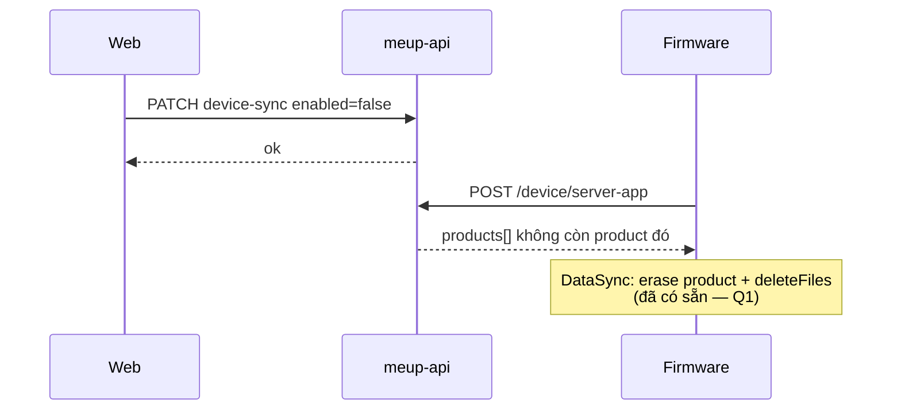

# Kế hoạch: Bật/tắt đồng bộ sản phẩm lên thiết bị (ServerApp)

> **Trạng thái:** Đã chốt + **đã triển khai code** (meup-api + meup-web). Cần migrate DB `000039` rồi QA sync thiết bị.  
> **Phạm vi:** **meup-api** (`d:\giapsoft\gits\meup-api`) + **meup-web**. Firmware chỉ bị ảnh hưởng gián tiếp qua catalog `POST /api/device/server-app` (không đổi wire format nếu chỉ **bỏ** product khỏi list).  
> **Mục tiêu:** User có nút bật/tắt trên mọi product họ **được phép dùng** (tự tạo / mua / được share đã accept). Tắt → product **không** còn trong ServerApp → lần sync sau firmware **gỡ** product + file local (hành vi DataSync sẵn có). Quyền sở hữu / mua / share **không** bị thu hồi.  
> **Ngoài phạm vi v1:** push notify khi tắt; per-device toggle (nhiều máy một user); ẩn product khỏi Explore; soft-delete product phía owner; đổi firmware.

---

## 0. Hiện trạng (baseline)


| Khía cạnh                  | Hôm nay                                                                                              |
| -------------------------- | ---------------------------------------------------------------------------------------------------- |
| Ai được dùng product       | Owner (`product.creator_id`) **hoặc** mua (`transaction`) **hoặc** share đã accept (`product_share`) |
| Web library                | `/products` — tab **Mine** (owned) / **Received** (purchased + shared từ `device-programs`)          |
| Firmware catalog           | `POST /api/device/server-app` → ServerApp compact **v4**: mọi product user được dùng (đã packaging)  |
| Web mirror                 | `GET /api/product/device-programs` — cùng 3 nguồn access, nhóm theo lang pair                        |
| Download file (device)     | `POST /api/device/package-link/download` — ACL = owned ∪ purchased ∪ shared (`UserHasLinkAccess`)    |
| Bật/tắt sync               | **Không có** — access = luôn sync                                                                    |
| `shareMode` public/private | Chỉ marketplace visibility — **không** phải on-device enable                                         |


**SQL hiện tại** (`ListServerApp` / `ListDevicePrograms`):

```text
owned:     product WHERE creator_id = user
bought:    transaction JOIN product …
shared:    product_share JOIN product …
```

Không có preference per-user.

**Kết luận:** Feature là **preference sync per (user, product)** — greenfield. ACL giữ nguyên; chỉ lọc lúc build catalog thiết bị (+ chặn download device theo C5).

---

## 1. Quyết định sản phẩm — đã chốt ✅


| #       | Quyết định                        | Chốt                                                                                            | Ghi chú                                     |
| ------- | --------------------------------- | ----------------------------------------------------------------------------------------------- | ------------------------------------------- |
| **C1**  | Ý nghĩa nút                       | **Bật/tắt đồng bộ lên thiết bị** (`deviceSyncEnabled`). Không xóa ownership / purchase / share. | Copy UI: “Dùng trên thiết bị” / “On device” |
| **C2**  | Phạm vi product                   | Owned + purchased + shared (đã accept). Pending invite **không**.                               | Khớp 3 nguồn ServerApp                      |
| **C3**  | Default                           | **Bật** (`true`). Không có row preference = bật.                                                | Zero backfill                               |
| **C4**  | ServerApp                         | Product tắt → **không** nằm trong `products[]` (và file chỉ còn nếu product khác còn dùng).     | **Không** bump compact v4                   |
| **C5**  | Download device (`X-Device-Auth`) | Tắt → `403` / `ErrLinkAccessDenied` nếu link chỉ thuộc product đang tắt.                        | Tránh tải lậu khi đã có `fileId` cũ         |
| **C6**  | Download web (JWT)                | **Vẫn cho** nếu còn ACL (edit / preview). Toggle chỉ ảnh hưởng device sync.                     |                                             |
| **C7**  | Translator / font enrich          | Chỉ tính product **đang bật** khi suy native-lang / “có catalog”.                               | Khớp ServerApp                              |
| **C8**  | Web vẫn hiện product tắt          | Có — card xám / switch off; vẫn Edit / Share / Settings (owned).                                | Không biến mất khỏi library                 |
| **C9**  | Granularity                       | Per **user** (JWT `sub` / user gắn device), không per-device-order.                             | Đủ v1 (1 user ↔ device link)                |
| **C10** | Wire ServerApp                    | Giữ v4. Firmware **đã** gỡ product + file local khi không còn trong catalog.                    | Không đổi meup firmware                     |


Shared list web: **B + C** (§4.3) — `GET /api/product/shared` cho library; `device-programs` / ServerApp chỉ product **enabled**.

### 1.1 Ngoài phạm vi v1

- Toggle riêng từng `device_order` khi một user gắn nhiều máy.
- Owner “force disable” mọi người dùng product của mình.
- Ẩn khỏi Explore / catalog marketplace.
- Compact `device-programs` bump chỉ để thêm flag.
- Đổi firmware USB / OTA protocol.

### 1.2 Câu hỏi đã chốt


| #      | Câu hỏi                                             | Chốt                                                                                                                                                                                                                     |
| ------ | --------------------------------------------------- | ------------------------------------------------------------------------------------------------------------------------------------------------------------------------------------------------------------------------ |
| **Q1** | Product biến mất khỏi ServerApp → firmware làm gì?  | **Xóa khỏi máy** — đã có sẵn trong DataSync (`mappingProducts_` erase id không còn trên server; `mappingFiles_` `deleteFiles` path không còn). Không đổi firmware. Copy UX: tắt = gỡ khỏi thiết bị **khi sync lần sau**. |
| **Q2** | Tắt hết product → font / translator / `appVersion`? | Theo đề xuất C7: font/translator chỉ khi còn ≥1 product **enabled**. `appVersion` OTA vẫn độc lập (không phụ thuộc product).                                                                                             |
| **Q3** | Optimistic UI?                                      | **Có** — optimistic + rollback khi API lỗi.                                                                                                                                                                              |


**Bằng chứng Q1** (`meup` `DataSyncController.h`):

- Product local không có trong `sv.products` → `erase` khỏi `local_.products` + cập nhật `allowProductIds`.
- File local không có trong `sv.files` → đưa path vào `deletePaths` → `IStorage::deleteFiles`.

---

## 2. Tóm tắt hành vi

```text
User mở /products → mỗi card có switch “Dùng trên thiết bị”
        ↓ bật/tắt
PATCH /api/product/device-sync { productId, enabled }
        ↓
Lưu preference (sparse: chỉ lưu khi tắt, hoặc upsert enabled)
        ↓
Lần sync tiếp theo:
  POST /api/device/server-app  → chỉ product enabled
  package-link download (device) → từ chối nếu product nguồn đang tắt
```


| Hành động                      | Kết quả                                             |
| ------------------------------ | --------------------------------------------------- |
| Tắt owned / purchased / shared | Vẫn trong library web; **không** vào ServerApp      |
| Bật lại                        | Xuất hiện lại ServerApp lần sync sau                |
| Unshare / mất ACL              | Preference orphan có thể GC sau (không bắt buộc v1) |
| Accept invite mới              | Default **bật**                                     |
| Purchase mới                   | Default **bật**                                     |


---

## 3. Model dữ liệu (meup-api)

### 3.1 Bảng mới (đề xuất sparse — chỉ lưu **tắt**)

```sql
-- migration 000039_user_product_device_sync_off.up.sql
CREATE TABLE user_product_device_sync_off (
    user_id    BIGINT NOT NULL REFERENCES muser (id) ON DELETE CASCADE,
    product_id BIGINT NOT NULL REFERENCES product (id) ON DELETE CASCADE,
    created_at TIMESTAMPTZ NOT NULL DEFAULT now(),
    PRIMARY KEY (user_id, product_id)
);

CREATE INDEX idx_user_product_device_sync_off_product
    ON user_product_device_sync_off (product_id);
```


| Quy ước          | Ý nghĩa                           |
| ---------------- | --------------------------------- |
| **Không có row** | `deviceSyncEnabled = true`        |
| **Có row**       | `deviceSyncEnabled = false`       |
| Bật lại          | `DELETE` row                      |
| Tắt              | `INSERT … ON CONFLICT DO NOTHING` |


**Ưu điểm:** không backfill; list “đang tắt” rẻ; default đúng C3.

**Phương án B (nếu muốn audit rõ):** bảng `user_product_device_sync (user_id, product_id, enabled, updated_at)` upsert mỗi lần đổi — hơi nặng hơn, dễ báo cáo.

### 3.2 Cập nhật `docs/DATABASE.md`

Thêm mục: preference sync thiết bị; **không** thay ACL `transaction` / `product_share`.

---

## 4. API (meup-api)

### 4.1 Endpoint mới

#### `PATCH /api/product/device-sync`

- **Auth:** JWT (`auth.Middleware`)
- **Body:**

```json
{ "productId": "42", "enabled": false }
```

- **Điều kiện:** caller phải còn access (owner **hoặc** transaction **hoặc** product_share). Không access → `403 forbidden` / `404 not_found` (chọn một, thống nhất với settings).
- **Hành vi:** `enabled=false` → insert sparse off; `enabled=true` → delete sparse off.
- **Response** `data`**:**

```json
{ "productId": "42", "enabled": false }
```


| Lỗi                   | Code                  |
| --------------------- | --------------------- |
| Body thiếu / sai      | `400 invalid_request` |
| Không access          | `403 forbidden`       |
| Product không tồn tại | `404 not_found`       |


Đăng ký trong `ProductRouter()` cạnh `PATCH /settings`.

### 4.2 List web — trả thêm `deviceSyncEnabled`


| Endpoint                     | Thay đổi                                   |
| ---------------------------- | ------------------------------------------ |
| `GET /api/product/owned`     | Mỗi product + `deviceSyncEnabled: boolean` |
| `GET /api/product/purchased` | Mỗi product + `deviceSyncEnabled: boolean` |
| Shared trên web              | Xem §4.3                                   |


Join / anti-join:

```sql
NOT EXISTS (
  SELECT 1 FROM user_product_device_sync_off off
  WHERE off.user_id = $user AND off.product_id = p.id
) AS device_sync_enabled
-- hoặc: (off.product_id IS NULL) sau LEFT JOIN
```

### 4.3 Shared list trên web

Hiện shared lấy từ `GET /api/product/device-programs` (compact). Hai hướng:


| Hướng | Mô tả                                                                                                                      | Trạng thái |
| ----- | -------------------------------------------------------------------------------------------------------------------------- | ---------- |
| **A** | `device-programs` vẫn trả **mọi** access + thêm flag `enabled` trong compact (bump v1→v2)                                  | Không chọn |
| **B** | Thêm `GET /api/product/shared` JSON đơn giản (như purchased) có `deviceSyncEnabled`; web Received/shared dùng endpoint này | ✅ Đã chốt  |
| **C** | `device-programs` chỉ còn product **enabled** (đồng bộ ServerApp); web shared lấy từ endpoint B                            | ✅ Đã chốt  |


**Đã chốt B + C:**

- Web library shared → `GET /api/product/shared` (+ flag).
- `device-programs` (debug/Postman) → **chỉ enabled**, khớp ServerApp.

### 4.4 ServerApp + access checks

`ListServerApp` — thêm điều kiện vào cả 3 nhánh UNION:

```sql
AND NOT EXISTS (
  SELECT 1 FROM user_product_device_sync_off off
  WHERE off.user_id = $1::bigint AND off.product_id = p.id
)
```

`ListDevicePrograms` — cùng filter enabled (hướng C).

`UserHasLinkAccess` (device download path): thêm cùng điều kiện “product nguồn không nằm trong sync_off” — hoặc helper dùng chung `userMaySyncProduct(userID, productID)`.

`userHasNativeLangAccess` **/** `userHasServerAppCatalogAccess`**:** filter theo product **enabled** (C7).

### 4.5 Docs API

Cập nhật `meup-api/docs/API.md` + `POSTMAN.md`:

- Mô tả `PATCH /api/product/device-sync`
- Ghi chú ServerApp: “chỉ product `deviceSyncEnabled`”
- Field mới trên owned/purchased/(shared)

**Không** đổi schema compact v4 ServerApp.

---

## 5. UX (meup-web)

### 5.1 Vị trí nút

```text
/products
  Mine (owned)     → mỗi OwnedProductCard: switch
  Received
    purchased      → PurchasedProductCard: switch
    shared         → SharedProductCard: switch
```

- Switch gần tiêu đề card (phải), label ngắn + `aria-checked`.
- Pattern tham chiếu: `ThemeToggle` (`role="switch"`) — tái sử dụng style nút hiện có, không thêm design system mới.
- Card tắt: giảm opacity nhẹ / badge “Tắt trên thiết bị” (i18n).

### 5.2 Hành vi

1. Load list → đọc `deviceSyncEnabled`.
2. Toggle → cập nhật UI ngay (optimistic) + gọi `PATCH …/device-sync`.
3. Lỗi → toast + rollback state.
4. Owned vẫn mở được Edit / Share / Settings khi tắt.
5. Explore / Buy: không hiện switch (chưa access); sau mua về Received với default bật.

### 5.3 API client

`src/api/product.ts`:

- `setProductDeviceSync(productId, enabled)`
- Extend DTO: `OwnedProductDto`, `PurchasedProductDto`, (+ `SharedProductDto` nếu endpoint mới)
- Shared tab: chuyển từ `getDevicePrograms` → `listSharedProducts` (nếu chốt B)

### 5.4 i18n

Keys đề xuất (`en.json` / `vi.json`):


| Key                           | vi                                     | en                                    |
| ----------------------------- | -------------------------------------- | ------------------------------------- |
| `products.deviceSync.label`   | Dùng trên thiết bị                     | On device                             |
| `products.deviceSync.onHint`  | Bộ từ sẽ đồng bộ khi máy gọi ServerApp | Syncs when the device calls ServerApp |
| `products.deviceSync.offHint` | Không đồng bộ lên thiết bị             | Not synced to the device              |
| `products.deviceSync.error`   | Không đổi được trạng thái              | Could not update sync setting         |


---

## 6. Ảnh hưởng firmware (gián tiếp)




| Thành phần            | Đổi?                                                             |
| --------------------- | ---------------------------------------------------------------- |
| Compact v4 positional | **Không**                                                        |
| Firmware binary       | **Không** — reuse DataSync mapping (erase product + delete file) |
| OTA `appVersion`      | Không liên quan; vẫn trả khi admin publish                       |
| Timing                | Có hiệu lực từ lần `server-app` **sau** khi tắt                  |


QA: tắt → sync → product/file local bị gỡ → bật → sync → tải lại.

---

## 7. Test plan

### 7.1 meup-api


| Case                                   | Kỳ vọng                                 |
| -------------------------------------- | --------------------------------------- |
| Owner tắt → `ListServerApp`            | Product không có trong `products`       |
| Buyer tắt / sharee tắt                 | Tương tự                                |
| Default không row                      | Vẫn có trong ServerApp                  |
| `PATCH` khi không access               | 403/404                                 |
| Device `package-link/download` khi tắt | Access denied                           |
| JWT `package-link/download` khi tắt    | Vẫn ok nếu còn ACL (C6)                 |
| Tắt hết product                        | `products=[]`; font/translator theo C7  |
| Xóa product / unshare                  | Row sync_off cascade hoặc orphan vô hại |


Unit/integration: mở rộng `server_app_test.go`, `device_programs_test.go`, `link_download_test.go`.

### 7.2 meup-web


| Case                    | Kỳ vọng               |
| ----------------------- | --------------------- |
| Switch trên 3 loại card | Gọi API + UI cập nhật |
| Reload trang            | State khớp server     |
| Tắt + vẫn Edit owned    | OK                    |
| i18n vi/en              | Đủ key                |


### 7.3 E2E device (Postman / máy thật)

1. Redeem / device auth → `server-app` thấy product.
2. Web tắt → `server-app` lại → product biến mất.
3. Bật → xuất hiện lại.
4. Thử download link của product đã tắt → denied.

---

## 8. Thứ tự triển khai


| Phase | Việc                                                              | Repo     |
| ----- | ----------------------------------------------------------------- | -------- |
| **0** | ~~Chốt C1–C10 + Q1–Q3~~ ✅                                         | —        |
| **1** | Migration + store helper `IsDeviceSyncEnabled` / `SetDeviceSync`  | meup-api |
| **2** | Lọc `ListServerApp` + download device + translator/font access    | meup-api |
| **3** | `PATCH /device-sync` + field trên owned/purchased + `GET /shared` | meup-api |
| **4** | Docs API / DATABASE / Postman                                     | meup-api |
| **5** | Client API + switch trên ProductsPage cards + i18n (optimistic)   | meup-web |
| **6** | Test + QA sync thật với firmware                                  | cả hai   |


Ước lượng: API ~1–2 ngày; web ~0.5–1 ngày; QA device smoke (tắt/bật + sync).

---

## 9. Rủi ro & lưu ý


| Rủi ro                                   | Giảm thiểu                                                                    |
| ---------------------------------------- | ----------------------------------------------------------------------------- |
| User chưa sync sau khi tắt               | Copy: gỡ khỏi máy **khi sync lần sau** (firmware đã xóa khi catalog thiếu id) |
| User tưởng tắt = xóa ownership           | Copy rõ “chỉ thiết bị”; không đụng Purchase/Share                             |
| `device-programs` vs ServerApp lệch nhau | B+C: library (`/shared`) ≠ sync catalog                                       |
| Sparse table orphan sau unshare          | `ON DELETE CASCADE` từ `product`; optional GC theo `user_id` sau              |
| Nhiều product share cùng `fileId`        | Tắt một product: file vẫn còn nếu product khác enabled vẫn reference — đúng   |


---

## 10. Tiêu chí xong (DoD)

- [ ] User bật/tắt được mọi product mình được dùng trên `/products`
- [ ] Preference persist; default bật
- [ ] `POST /api/device/server-app` chỉ trả product đang bật
- [ ] Device download bị chặn khi product nguồn đang tắt
- [ ] Ownership / purchase / share không đổi khi tắt
- [ ] Docs API + DATABASE cập nhật
- [ ] Test API + smoke web + 1 vòng sync firmware

---

## 11. Tham chiếu code


| Khu vực              | Path                                                                    |
| -------------------- | ----------------------------------------------------------------------- |
| ServerApp query      | `meup-api/internal/product/server_app.go` → `ListServerApp`             |
| Device programs      | `meup-api/internal/product/device_programs.go`                          |
| Link ACL             | `meup-api/internal/packageversion/link_store.go` → `UserHasLinkAccess`  |
| Routes product       | `meup-api/internal/httpapi/routes/product.go`                           |
| Device catalog route | `meup-api/internal/httpapi/routes/device_catalog.go`                    |
| Library UI           | `meup-web/src/pages/ProductsPage.tsx`                                   |
| Product API client   | `meup-web/src/api/product.ts`                                           |
| Contract ServerApp   | `meup-api/docs/API.md` (§ `POST /api/device/server-app`)                |
| Schema ownership     | `meup-api/docs/DATABASE.md` (`product`, `transaction`, `product_share`) |


