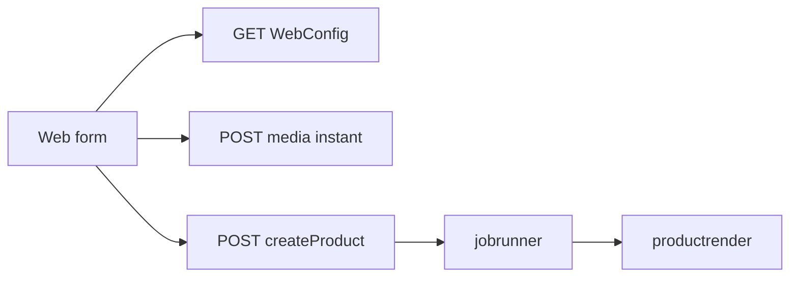
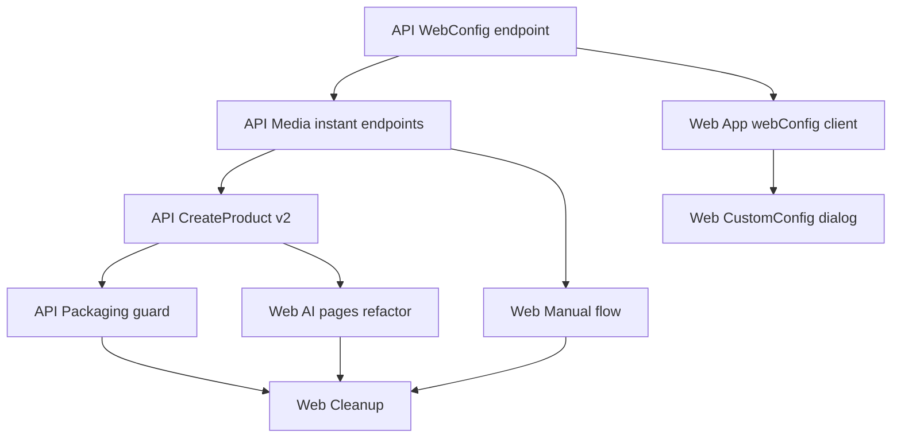

# Kế hoạch migration luồng meup-web ↔ meup-api (v2)

> **Trạng thái:** Spec implementation **v1.0 — đã duyệt**, sẵn sàng triển khai code.  
> **Ngày:** 2026-07-04  
> **Phạm vi:** Luồng tạo sản phẩm (create) **+ đồng bộ EditProgramPage**. Không quan tâm legacy data.

---

## 1. Mục tiêu

| Mục tiêu | Mô tả |
|----------|--------|
| **WebConfig tập trung** | Web lấy giá credit, giới hạn số từ, `defaultConfig` từ API — không hardcode `500`, `20`, `1000` trong UI |
| **Request có kiểu** | Một endpoint `createProduct` nhận body phân nhánh theo `type`: `manual` \| `title` \| `image` \| `paragraph` |
| **Media tức thì** | Generate/upload ảnh & audio từng item trả object key ngay (không qua job queue) |
| **Manual có staging** | `tempId` cho upload tạm; `cancelManualRequest` dọn tài nguyên |
| **Cấu hình gọn** | AI flows: form ngắn + dialog `CustomConfigProcess`; bỏ wizard nhiều bước cũ |
| **Edit đồng bộ** | `EditProgramPage` dùng chung `label`/`description`, `CustomConfig`, `MediaPickerDialog` |

---

## 2. Nguyên tắc thực hiện

1. **Xóa luồng cũ hoàn toàn** — không adapter, không dual-write, không migrate dữ liệu cũ.
2. **Giữ job runner + productrender** — chỉ đổi input/request; không refactor lớn.
3. **Giữ compact ProgramConfig v3** cho payload đóng gói (xem giải thích mục 12.3 — câu 9).
4. **Tận dụng tối đa** endpoint/route hiện có còn dùng được; không dùng được thì xóa, cập nhật tài liệu.
5. **EditProgramPage** đồng bộ trong cùng phase (schema web metadata, CustomConfig, media dialog).

---

## 3. Hiện trạng (as-is)

### 3.1 meup-web

| Thành phần | File chính | Hành vi hiện tại |
|------------|-----------|------------------|
| Hub tạo SP | `CreateProgramHubPage.tsx` | 4 lối: manual, title, paragraph, image |
| Manual wizard | `CreateProgramWizard.tsx` | 7 bước: name → schema → card → side → display → vocab → submit |
| AI title/paragraph/image | `CreateProgramFrom*Page.tsx` | setup → submit → toast; theo dõi tiến độ qua tab Create requests |
| API client | `api/productCreate.ts` | `POST /api/product-create` + `getProductCreateProgress` (không auto-poll) |
| Giá credit UI | `productCreateJobs.ts` | Hardcode `VOCAB_JOB_CREDITS_PER_UNIT = 500` |
| Giới hạn số từ AI | `aiVocabWordCount.ts` | Hardcode min 20, max 1000 |
| Media vocab | `vocabMedia.ts`, `VocabMediaPanel.tsx` | Chỉ local File + object URL; **không upload API** |
| Config state | React Context | `AccountProvider`, `LanguagePairProvider` — **không có** `App` singleton / `WebConfig` cache |
| Schema editor | `ItemSchemaEditor.tsx` | Field `name` (không có `description`) |

### 3.2 meup-api

| Thành phần | File chính | Hành vi hiện tại |
|------------|-----------|------------------|
| Create endpoint | `routes/product_create.go`, `productcreate/store.go` | Một body cố định: `ownerId`, `productName`, `payload` string, `jobs[]` |
| Job types client | Chỉ `vocab` | `audio`/`image` **server derive** từ `items` thiếu media |
| Pricing | `systemconfig` keys | `JOB_PRICE_VOCAB/AUDIO/IMAGE` — **không expose HTTP** |
| SchemaAttr | `jobcontent/item_schema.go` | `{ Key, Type, LangType }` — không có label/description |
| Media generate | `jobhandler/audio.go`, `image.go` | Chỉ qua job queue |
| Upload user media | — | **Không có** |
| tempId | `device_temp_id` | Chỉ device auth, không dùng cho product create |
| WebConfig | — | **Không tồn tại** |

### 3.3 Điểm lệch so với spec mới

**Luồng cũ**


**Luồng mới**



---

## 4. Kiến trúc mới (to-be)

### 4.1 WebConfig

Nguồn: `system_config` (PostgreSQL), aggregate qua `GET /api/web-config`.

```typescript
// Type gợi ý cho web (meup-web)
type WebConfig = {
  defaultConfig: ProgramConfig          // compact v3 decoded
  vocabPrice: number                    // ← JOB_PRICE_VOCAB
  audioPrice: number                    // ← JOB_PRICE_AUDIO
  imagePrice: number                    // ← JOB_PRICE_IMAGE
  descriptionPrice: number              // mới, default 500
  itemMinCount: number                  // chỉ AI flows (title/image/paragraph)
  itemMaxCount: number                  // chỉ AI flows
}

function validateItemCount(value: number): 'insufficient' | 'too_many' | null  // AI only

/** Manual — hardcode, không qua WebConfig */
const MANUAL_MIN_VOCAB_ITEMS = 8  // tối thiểu để học hiệu quả
```

| Key `system_config` | Mới? | Default đề xuất |
|---------------------|------|-----------------|
| `WEB_DEFAULT_PROGRAM_CONFIG` | ✅ | **Hardcode** trong Go/TS lúc triển khai; admin/DB cập nhật sau |
| `JOB_PRICE_VOCAB` | có sẵn | 500 |
| `JOB_PRICE_AUDIO` | có sẵn | 100 |
| `JOB_PRICE_IMAGE` | có sẵn | 500 |
| `JOB_PRICE_DESCRIPTION` | ✅ | 500 |
| `ITEM_MIN_COUNT` | ✅ | 20 — **chỉ** validate `count` AI flows |
| `ITEM_MAX_COUNT` | ✅ | 1000 — **chỉ** validate `count` AI flows |

> **Manual (`fromManual`):** tối thiểu **8 từ** — hardcode web + API (`MANUAL_MIN_VOCAB_ITEMS = 8`), không đọc `itemMinCount`. Lý do: nhập thủ công đặc biệt; 8 là ngưỡng tối thiểu để học hiệu quả.

**meup-api:** `internal/systemconfig/web_config.go` — đọc keys, decode `defaultConfig`, expose handler.

### 4.2 SchemaAttr (cập nhật)

**Wire / compact / package app** — không đổi shape hiện tại:

```
SchemaAttr { key, type, langType }
```

**Trao đổi web ↔ API** (chỉ create/config endpoints, không ghi vào export package):

```
SchemaAttrWeb {
  key, type, langType,
  label: string,        // required trên web
  description?: string  // optional, dùng cho AI image prompt / generate description
}
```

**Quy tắc:**
- Web luôn gửi/nhận `SchemaAttrWeb` trong `ProgramConfig` của create request và `WebConfig.defaultConfig`.
- API strip `label`/`description` trước khi marshal compact vào `payload` / export.
- `generateDescription` nhận danh sách attr thiếu `description`, trả về cập nhật cho web.

### 4.3 CreateProductRequest

```typescript
type CreateProductRequestBase = {
  title: string
  description?: string
  count: number                    // số từ vựng (AI) hoặc ignored (manual dùng items.length)
  config?: ProgramConfig | null    // null → defaultConfig từ WebConfig
  type: 'manual' | 'title' | 'image' | 'paragraph'
}

type FromManualRequest = CreateProductRequestBase & {
  type: 'manual'
  tempId: string
  items: ManualItem[]
  generateMediaForMissingItems: boolean
}

type FromTitleRequest = CreateProductRequestBase & {
  type: 'title'
  // title đã có ở base — dùng làm nội dung sinh từ
}

type FromImageRequest = CreateProductRequestBase & {
  type: 'image'
  imageBase64: string
}

type FromParagraphRequest = CreateProductRequestBase & {
  type: 'paragraph'
  paragraph: string
}

type ManualItem = {
  values: Record<string, string>   // text + object keys cho audio/image slots
}
```

**Credit check (server):** tính tổng trước khi insert; `402 insufficient_credits` nếu `user.creditBalance < total`.

### 4.3.1 Quy tắc tính credit (đã xác nhận)

| Loại | Công thức trừ credit lúc `createProduct` | Ghi chú |
|------|------------------------------------------|---------|
| `title` / `paragraph` / `image` | **`count × vocabPrice`** | Trọn gói 1 từ — **không** phát sinh phí audio/image/description ẩn |
| `manual` | Media job lúc create (nếu có): `audioPrice` / `imagePrice` theo slot thiếu khi `generateMediaForMissingItems=true` | **Không** dùng `vocabPrice`; slot đã có key từ endpoint nhỏ = đã trả trước |
| Endpoint nhỏ | `audioPrice` / `imagePrice` / `descriptionPrice × n` | Trừ **ngay mỗi lần gọi**; generate media **tính phí lại** khi user recreate |

**`vocabPrice` trọn gói (AI flows):**
- Bao gồm: sinh text từ vựng + mọi media AI server tạo kèm (audio/image child jobs trong vocab handler).
- Server **không** derive thêm job billing riêng cho media khi `type` là `title` / `paragraph` / `image`.
- Config có `text+audio` / `hasImage` **không** làm tăng giá — chỉ ảnh hưởng output.

**Hoàn credit khi AI không đủ từ vựng hoàn chỉnh (bắt buộc):**

Một **vocab item hoàn chỉnh** = có đủ mọi slot schema yêu cầu: text bắt buộc + mọi audio slot (`text+audio`) + image slot (nếu `hasImage`). Một item có thể có **nhiều media** — chỉ khi **tất cả** media required đều có object key hợp lệ mới tính là đủ.

**Không thể đếm sớm** sau vocab job — media có thể sinh/retry qua nhiều child jobs. Chỉ khi **đóng gói product lần đầu** (`productrender`), quét toàn bộ `items` theo schema mới biết chính xác.

```
completeCount = số item trong payload có đủ toàn bộ media theo schema
refundCount   = count - completeCount    // count = số từ user yêu cầu lúc create
refundCredits = refundCount × vocabPrice
```

- Trừ upfront lúc create: `count × vocabPrice`.
- Lưu `count` (requested) trên `create_product_request` để dùng lúc packaging.
- Trong `productrender`, trước/sau export thành công: tính `completeCount` → nếu `refundCount > 0` hoàn `refundCredits` qua `CPR_REFUND` (idempotent theo `requestId`).
- Item thiếu text hoặc thiếu bất kỳ media required → **không** tính vào `completeCount`.
- Web hiển thị note: *"Nếu không tạo đủ từ vựng hoàn chỉnh (kể cả ảnh/âm thanh) sẽ được trả lại credit thừa."*

**Ví dụ** (`count = 20`):

| Tình huống | `completeCount` | Hoàn |
|------------|-----------------|------|
| 20 item, đủ hết media | 20 | 0 |
| 18 item, 18 đủ media | 18 | `2 × vocabPrice` |
| 20 item, 17 đủ media (3 thiếu audio/ảnh) | 17 | `3 × vocabPrice` |
| 15 item (vocab job ít hơn), 15 đủ media | 15 | `5 × vocabPrice` |

**`manual` — tách biệt hoàn toàn:**
- Chỉ tính `audioPrice` / `imagePrice` khi:
  - User gọi endpoint nhỏ (generate/upload) — trừ ngay; hoặc
  - `generateMediaForMissingItems=true` — trừ lúc `createProduct` cho slot còn thiếu key.
- Không áp dụng `vocabPrice`, không hoàn credit theo số từ (user tự nhập items).
- **Tối thiểu 8 items** — validate web (`items.length >= 8`) và API (`len(items) < 8` → 400); không cấu hình qua `WebConfig`.

**`generateMediaForMissingItems = false` (manual):**
- Server **không** derive audio/image jobs cho slot trống.
- Packaging **không** gọi AI bù media thiếu.
- **Export:** cho phép nếu tỉ lệ media thiếu **< 20%** tổng slot media bắt buộc (`missingSlots / totalRequiredSlots < 0.20`); **≥ 20%** → fail request. Slot thiếu export dưới ngưỡng = file rỗng / placeholder.

**`title` với image / paragraph:**
- `CreateProductRequest.title` thay `productName` (OK).
- `fromImage` / `fromParagraph`: `title` optional trên form. Nếu trống → server **tự sinh title** (LLM) trước vocab job; **không** thêm bước UI. User muốn đổi tên → sửa sau (edit sản phẩm / settings).

### 4.4 Endpoints mới (meup-api)

| Method | Path đề xuất | Mô tả |
|--------|--------------|--------|
| `GET` | `/api/web-config` | Trả `WebConfig` |
| `POST` | `/api/product-create` | Giữ path; **đổi body** → `CreateProductRequest` by `type` |
| `POST` | `/api/product-create/generate-description` | Batch **tất cả attrs** (kể cả đã có `description`) để AI đọc ngữ cảnh; trừ `descriptionPrice × số attr thiếu` |
| `POST` | `/api/product-create/generate-audio` | Input: text, lang, `tempId` → `{ objectKey, previewUrl }`; trừ `audioPrice` **mỗi lần gọi** |
| `POST` | `/api/product-create/generate-image` | Input: prompt text, `tempId` → `{ objectKey, previewUrl }`; trừ `imagePrice` **mỗi lần gọi** |
| `POST` | `/api/product-create/upload-image` | multipart + `tempId` → `{userId}/{tempId}/...` → promote/copy key |
| `POST` | `/api/product-create/upload-audio` | tương tự |
| `POST` | `/api/product-create/cancel-manual` | Body: `{ tempId }` — xóa prefix storage |
| `GET` | `/api/product-create` | **Giữ** — owner từ JWT |
| `GET` | `/api/product-create/{id}/progress` | **Giữ** nếu còn phù hợp shape mới |
| `POST` | `/api/product-create/{id}/jobs/{jobId}/retry` | **Giữ** nếu retry job vẫn có ý nghĩa sau đổi input; không thì xóa + cập nhật docs |

**Auth:** `ownerId` lấy từ JWT `sub` — **bỏ** field `ownerId` khỏi body (breaking, OK theo spec).

**Object key & `tempId` (đã xác nhận):**
- Staging upload/generate: `{userId}/{tempId}/{uuid}.{ext}`
- **`createProduct` (manual):** validate mọi `objectKey` tham chiếu trong `items` phải thuộc `tempId` của request; **promote/move** sang vị trí permanent (`audios/...`, `images/...`) trước khi đóng gói — đảm bảo file tồn tại lúc packaging.
- Sau **create thành công** (request accepted + jobs queued): **xóa folder `tempId`** trên storage.
- Permanent keys (AI generate trong dialog đã Áp dụng): promote tương tự nếu còn dưới `tempId`.

**Generate media nhỏ — trong dialog, chưa commit dòng (đã xác nhận):**
- Response `generate-audio` / `generate-image` trả `{ objectKey, previewUrl }`.
- Generate **trừ credit mỗi lần gọi** (kể cả recreate trong dialog).
- `objectKey` lưu trên server ngay; **chưa** ghi vào `values[slot]` cho đến khi user bấm **Áp dụng** trong dialog.
- Object key generate nhưng user **Hủy** dialog → không gắn vào item (file orphan dưới `tempId` — dọn khi `cancel-manual` / TTL).

### 4.5 meup-web — `App` singleton

```typescript
// src/app/App.ts (mới)
class App {
  private static _internal = new App()
  static get(): App { return App._internal }

  private _config: WebConfig | null = null
  studyLangCode: string
  nativeLangCode: string   // fallback browser locale
  studyLangName: string
  nativeLangName: string

  async config(): Promise<WebConfig>  // load once, RAM cache, deep copy on read
  static onUserLogout(): void         // _internal = new App()
}
```

**Tích hợp:**
- Khởi tạo lang từ `LanguagePairProvider` / browser locale.
- `AccountProvider.creditBalance` ↔ `User.currentCredit` trong spec (có thể alias, không cần class `User` riêng).
- Gọi `App.onUserLogout()` từ `useClearDeviceSession`.

---

## 5. Luồng UI chi tiết (meup-web)

### 5.1 Chung cho `fromTitle` / `fromImage` / `fromParagraph`

**Thay thế** toàn bộ `CreateProgramFrom*Page.tsx` (bỏ step `schema`, `review` inline).

```
┌─────────────────────────────────────┐
│ Input theo loại + itemCount         │
│ Validator: count × vocabPrice ≤ credit │
│ Note: thiếu từ hoàn chỉnh → hoàn (count - complete) × vocabPrice │
├─────────────────────────────────────┤
│ [Cấu hình]  [Quay lại] [Đồng ý]     │
└─────────────────────────────────────┘
```

- **Cấu hình:** `request.config ??= App.get().config().defaultConfig` → `CustomConfigProcess` dialog.
- Nút Cấu hình: `primary` nếu config ≠ default, `secondary` nếu bằng default.
- **Đồng ý:** `POST createProduct` → toast thành công → user có thể rời trang; theo dõi tiến độ tại tab **Create requests** (mục 5.4).

| Loại | Input |
|------|-------|
| Title | `title`* , `description`, `itemCount`* |
| Image | `image`* , `title` optional, `itemCount`* — server sinh title nếu trống |
| Paragraph | `paragraph`* , `title` optional, `itemCount`* — server sinh title nếu trống |

`itemCount` validate qua `WebConfig.validateItemCount` (thay `aiVocabWordCount.ts` hardcode).

### 5.2 `fromManual`

**Thay thế** `CreateProgramWizard.tsx`.

**Trang chính:** `title`*, `description` optional.

**Footer:**
- `tempId = randomUUID()` khi vào trang (hoặc khi bấm Tiếp tục).
- Left: Cấu hình (giống AI).
- Right: Quay lại | **Tiếp tục** → dialog nhập từ vựng.

**Dialog nhập từ vựng** (refactor `VocabEntryStep` + `VocabMediaPanel`):

| Thay đổi | Chi tiết |
|----------|----------|
| Bỏ | Preview theo dòng đang chọn (selection highlight) |
| Media inline | Icon **+image** / **+sound** trên dòng → mở **MediaPickerDialog** |
| Dialog chọn media | Xem mục **5.2.1** — preview song song, commit khi Áp dụng |
| Checkbox | Hiện khi `items.some(missingAnyMedia)` — label kèm `calculateTotalPrice()` |
| Validator footer | `items.length >= 8` (**hardcode**), mỗi item ≥1 property non-empty |
| Hủy | Confirm → `cancelManualRequest(tempId)` |
| Đồng ý | `FromManualRequest` + `generateMediaForMissingItems` → toast; theo dõi tại tab Create requests |

**Ghi chú UI — icon trên dòng:**
- Mỗi media slot: icon button (**+image** / **+sound**), `aria-label` + tooltip.
- Đã có media → thumbnail nhỏ / icon đã gắn trên dòng; bấm icon mở dialog (không sửa trực tiếp trên dòng).

#### 5.2.1 `MediaPickerDialog` (đã xác nhận)

Dialog mở khi bấm icon media. **Không thay `values[slot]`** cho đến khi user bấm **Áp dụng**. **Hủy** → không đổi gì.

**Layout dialog:**

```
┌──────────────── MediaPickerDialog ─────────────────┐
│  [Hiện tại]          │  [Đang thử] (draft)        │
│  preview giá trị cũ  │  preview lựa chọn mới      │
│  (nếu có; luôn hiện  │  (cập nhật khi user thao    │
│   ô này khi đã gắn)  │   tác; trống lúc mới mở)   │
├────────────────────────────────────────────────────┤
│  Upload file │ Clipboard │ Paste URL │ Generate AI │
│  (Generate lại — trừ credit mỗi lần)               │
├────────────────────────────────────────────────────┤
│  [Hủy]                        [Áp dụng] (primary)  │
└────────────────────────────────────────────────────┘
```

| Nguồn | Hành vi trong dialog | Khi **Áp dụng** |
|-------|----------------------|-----------------|
| **Upload file** | Giữ `File` local; `URL.createObjectURL` → preview draft tại chỗ | Gọi `POST upload-*` + `tempId` → nhận `objectKey` → ghi `values[slot]` |
| **Clipboard** | Đọc file từ clipboard → xử lý như upload (preview local tại chỗ) | Upload server nếu local → ghi `objectKey` |
| **Paste URL** | Fetch/validate URL tại chỗ → preview draft song song (ảnh/audio stream) | Nếu cần: tải & `upload-*`; hoặc lưu key/URL theo quy ước API → ghi `values[slot]` |
| **Generate AI** | Gọi `generate-audio` / `generate-image` → nhận `objectKey` + `previewUrl` → preview draft | `objectKey` đã trên server → ghi thẳng `values[slot]` (không upload lại) |
| **Generate lại** | Gọi lại generate → trừ credit; thay **draft** preview (không đổi cột Hiện tại) | Giống Generate AI |

**Quy tắc:**
- Ô **Hiện tại**: luôn hiển thị media đang gắn trên dòng (nếu có); không đổi trong suốt phiên dialog.
- Ô **Đang thử**: draft tạm; upload/clipboard/URL preview ngay tại chỗ; AI chờ `objectKey` + data từ server.
- **Áp dụng** enabled khi draft hợp lệ; thất bại upload → toast, không đóng dialog.
- **Hủy** / đóng dialog: revoke blob URL draft; **không** đụng `values[slot]`; credit đã trừ cho generate vẫn giữ (server đã tạo file).

```typescript
type MediaPickerDraft =
  | { kind: 'local'; file: File; previewUrl: string }
  | { kind: 'fetchedUrl'; sourceUrl: string; previewUrl: string }
  | { kind: 'server'; objectKey: string; previewUrl: string }

// onApply(draft) → upload if local/fetched → values[slot] = objectKey
// onCancel() → discard draft only
```

### 5.4 Theo dõi tiến độ create request (đã xác nhận)

**Không poll nền** — bỏ `pollProductCreateProgress` / `pollProductCreateProgressWithUpdates` và mọi `setInterval` chờ product process.

**Tab Create requests** (`ProductsPage`):

| Hành vi | Chi tiết |
|---------|----------|
| Nút **Refresh** | Luôn **enabled**; user chủ động gọi `GET /api/product-create` (list) + `GET .../progress` cho từng request đang chạy |
| Rate limit | Tối đa **1 lần / 5 giây**; track `lastRefreshAt` trong component state |
| Ấn quá sớm | **Toast** thông báo (vd. *"Vui lòng đợi X giây"*); **không** disable nút Refresh |
| Sau submit | Toast thành công; user tự chuyển tab hoặc ở lại — không auto-poll inline trên trang create |

**Implementation gợi ý (web):**

```typescript
const REFRESH_COOLDOWN_MS = 5000

function onRefreshClick() {
  const elapsed = Date.now() - lastRefreshAt
  if (elapsed < REFRESH_COOLDOWN_MS) {
    toast(t('createRequests.refreshTooSoon', { seconds: Math.ceil((REFRESH_COOLDOWN_MS - elapsed) / 1000) }))
    return
  }
  lastRefreshAt = Date.now()
  await fetchCreateRequestsAndProgress()
}
```

### 5.3 `CustomConfigProcess` dialog

**Tách** từ wizard cũ thành dialog 2 bước dùng chung mọi flow create.

**Step 1 — Cấu trúc thẻ từ:**
- `hasImage` checkbox
- Danh sách attr: drag reorder, `label`*, `description`, type toggle, langType toggle (3 trạng thái: study / native / none)
- Actions: Thêm Text, Thêm Text+Audio, **Tạo Description còn thiếu** (gọi `generate-description`)
- Validator: ≥1 attr có `langType` study hoặc native

**Step 2 — Cấp độ & thẻ:**
- Tái sử dụng `CardSetupStep`, `SideEditorStep`, `DisplayElementEditorStep` (logic hiện tại)
- Validator: mỗi level ≥2 sides; mỗi side ≥1 play step (pause hoặc play audio attr)

**Footer:** Quay lại (step trước / đóng) | Tiếp tục (validate → next / return config)

---

## 6. Kế hoạch triển khai meup-api

### Tiến độ triển khai

| Phase | Trạng thái | Ghi chú |
|-------|------------|---------|
| **A** WebConfig | ✅ Xong | `GET /api/web-config` |
| **B** Schema web metadata | ✅ Xong — chờ nghiệm thu | `jobcontent/web_schema.go` |
| **C** Media instant | ✅ Xong — chờ nghiệm thu | `instantmedia/`, `routes/product_create_media.go` |
| **D** CreateProduct v2 | ✅ Xong — chờ nghiệm thu | `productcreate/create_v2.go`, migration `000029` |
| **E** Packaging + refund | ✅ Xong — chờ nghiệm thu | `productrender/packaging_guard.go`, `vocab_completeness.go` |
| **F** Dọn legacy API | ✅ Xong — chờ nghiệm thu | Postman + docs |

### Phase A — WebConfig & system_config ✅ (2026-07-05)

- [x] Thêm keys: `WEB_DEFAULT_PROGRAM_CONFIG`, `JOB_PRICE_DESCRIPTION`, `ITEM_MIN_COUNT`, `ITEM_MAX_COUNT`
- [x] Migration seed `000028_web_config_keys` (description, min, max)
- [x] `GET /api/web-config` — `internal/webconfig`, `routes/web_config.go`
- [x] Unit test: `internal/webconfig/*_test.go`
- [x] Document `docs/API.md`

**Files meup-api:**

| File | Thay đổi |
|------|----------|
| `internal/systemconfig/keys.go` | +4 keys |
| `internal/systemconfig/jobprice.go` | +Description, ItemMin/Max getters |
| `internal/webconfig/*` | Config loader + hardcoded default |
| `internal/httpapi/routes/web_config.go` | Handler |
| `internal/httpapi/router.go` | Mount `/web-config` |
| `internal/database/migrations/000028_*` | Seed keys |

### Phase B — Schema web metadata ✅ (2026-07-05)

- [x] DTO `SchemaAttrWeb` / `ProgramConfigWeb` — `internal/jobcontent/web_schema.go`
- [x] `StripWebOnlyFields()`, `MarshalProductPayloadConfig()` — compact không chứa label/description
- [x] `SchemaAttr.Label`, `SchemaAttr.Description` — in-memory web metadata
- [x] `GetEnDescription` ưu tiên attrs có `Description` metadata
- [x] `vocab_prompt` dùng `DisplayLabel()` thay `Key`
- [x] `webconfig` dùng chung `jobcontent.ProgramConfigWeb`
- [x] Tests: `web_schema_test.go`

**Files meup-api:**

| File | Thay đổi |
|------|----------|
| `internal/jobcontent/item_schema.go` | +Label/Description; GetEnDescription priority |
| `internal/jobcontent/web_schema.go` | DTO + parse/strip/marshal |
| `internal/jobcontent/web_schema_test.go` | Unit tests |
| `internal/jobhandler/vocab_prompt.go` | DisplayLabel |
| `internal/webconfig/types.go` | Alias `jobcontent.ProgramConfigWeb` |
| `internal/webconfig/default_config.go` | Dùng shared types |

### Phase C — Endpoints media tức thì ✅ (2026-07-05)

- [x] `generate-audio`, `generate-image` — `tts` / `img` + `cache_storage`; response `{ objectKey, previewUrl }`
- [x] Mỗi request generate = trừ credit (`audioPrice` / `imagePrice`); recreate = key mới + trừ lại
- [x] `upload-image`, `upload-audio` — multipart, prefix `{userId}/{tempId}/`
- [x] `generate-description` — batch attrs, LLM, charge `descriptionPrice × missing`
- [x] `cancel-manual` — `storage.DeleteDir` + dọn local cache
- [x] Credit reason `CPR_MEDIA_INSTANT` (`credit.ModifyCredits`)

| File | Thay đổi |
|------|----------|
| `internal/instantmedia/` | Service + staging keys + tests |
| `internal/httpapi/routes/product_create_media.go` | HTTP handlers |
| `internal/httpapi/routes/product_create.go` | Mount routes |
| `internal/credit/modify_credits.go` | `ReasonCPRMediaInstant` |
| `docs/API.md` | Document instant endpoints |

### Phase D — CreateProductRequest v2 ✅ (2026-07-05)

- [x] Refactor `productcreate/store.go` — typed `CreateV2Input`, JWT owner
- [x] Parse body theo `type`; build `payload` `{ config, items }`
- [x] AI types: `count × vocabPrice`; lưu `requested_vocab_count`; không bill media jobs riêng
- [x] Manual: validate/promote `tempId` keys; `len(items) < 8` → 400; `generateMediaForMissingItems`
- [x] image/paragraph: sinh `title` server nếu trống
- [x] Vocab jobs: `fromTitle` / `fromParagraph` / `fromImage`
- [x] Xóa code path nhận client `jobs[]`

| File | Thay đổi |
|------|----------|
| `internal/productcreate/create_v2.go` | Prepare jobs + payload by type |
| `internal/productcreate/staging_promote.go` | Promote staging media keys |
| `internal/productcreate/title_generate.go` | LLM title for image/paragraph |
| `internal/jobcontent/item_schema.go` | `RowFromManualValues` |
| `internal/jobcontent/payload_marshal.go` | `MarshalProductPayload` |
| `internal/database/migrations/000029_*` | `requested_vocab_count` column |
| `internal/httpapi/routes/product_create.go` | V2 request body |
| `docs/API.md` | V2 create body docs |

### Phase E — Packaging guard + hoàn credit AI ✅ (2026-07-05)

- [x] `productrender`: `skipAIMedia` khi manual `generateMediaForMissingItems=false`
- [x] Export manual flag=false: fail nếu `missingSlots/totalRequiredSlots >= 0.20`
- [x] `CountCompleteVocabItems` / `IsCompleteVocabItem` — `jobcontent/vocab_completeness.go`
- [x] Lúc đóng gói AI: `refundCount = requestedCount - completeCount`; hoàn `refundCount × vocabPrice` (`RefundAIVocabSurplus`)
- [x] Sau create manual thành công: xóa storage prefix `staging_temp_id` (`CancelManual`)

| File | Thay đổi |
|------|----------|
| `internal/database/migrations/000030_*` | `generate_media_for_missing_items`, `staging_temp_id` |
| `internal/jobcontent/vocab_completeness.go` | Complete count + media slot stats |
| `internal/productrender/packaging_guard.go` | 20% guard + skip AI flag |
| `internal/productrender/item_collector.go` | `skipAIMedia` — không fallback computed path |
| `internal/productcreate/refund.go` | `RefundAIVocabSurplus` |
| `internal/productrender/runner.go` | Guard, refund, temp cleanup |

### Phase F — Dọn legacy API ✅ (2026-07-05)

- [x] Handler chỉ nhận body v2 (không `ownerId` / `jobs[]` / `payload` từ client)
- [x] Cập nhật `docs/POSTMAN.md` + `postman/meup-api.postman_collection.json`
- [x] Cập nhật `docs/DATABASE.md`
- [x] Cập nhật `meup-web/docs/API_UI_GAP.md`

---

## 7. Kế hoạch triển khai meup-web

### Phase 1 — Foundation ✅ (2026-07-05)

- [x] `src/app/App.ts` singleton + `api/webConfig.ts` + `types/webConfig.ts`
- [x] `API_WEB_CONFIG` trong `src/config.ts`
- [x] Wire logout → `App.onUserLogout()`; preload config khi authorized
- [x] Thay `VOCAB_JOB_CREDITS_PER_UNIT` / `aiVocabWordCount` constants bằng `App.get()`

### Phase 2 — API client v2 ✅ (2026-07-05)

- [x] `api/productCreate.ts` — types `CreateProductRequest*`, bỏ `CreateProductJob`
- [x] `api/productCreateMedia.ts` — generate/upload/cancel endpoints
- [x] `utils/pricing.ts` — `calculateManualMediaPrice`, `validateItemCount`, `estimateAIVocabCredits`
- [x] `utils/programConfigWeb.ts` — map schema/levels → `ProgramConfigWeb`
- [x] Create pages + wizard gọi body v2 (tạm giữ UI cũ; refactor UI Phase 4–5)

### Phase 3 — CustomConfigProcess ✅ (2026-07-05)

- [x] `components/create/CustomConfigDialog.tsx` (step 1 schema + step 2 levels/sides)
- [x] `ItemSchemaEditor` / `SchemaFieldRow`: `label` + `description`, langType 3-state
- [x] `generate-description` action trong step 1
- [x] `utils/customConfigState.ts`, `utils/customConfigValidation.ts`
- [x] Demo wire: `CreateProgramFromTitlePage` — nút "Cấu hình nâng cao"

### Phase 4 — AI create pages ✅ (2026-07-05)

- [x] Refactor `CreateProgramFromTitlePage` → áp dụng paragraph, image
- [x] Layout bottom actions thống nhất (`AiCreateFooter`)
- [x] Xóa step schema/review; `CustomConfigDialog` qua nút Cấu hình
- [x] Bỏ auto-poll sau submit; banner + link tab Create requests

### Phase 5 — Manual create ✅ (2026-07-05)

- [x] Trang mới `CreateProgramManualPage` thay route wizard
- [x] `MediaPickerDialog` — preview Hiện tại / Đang thử; upload / clipboard / paste URL / generate; Áp dụng mới commit
- [x] `VocabEntryDialog` — icon media trên dòng, `tempId` cho upload
- [x] Checkbox `generateMediaForMissingItems`

### Phase 6 — Dọn legacy web

- [ ] Xóa `CreateProgramWizard.tsx`, `productCreateJobs.ts`, `CreateProgramAiSoonPage.tsx`
- [ ] Xóa `WizardProgress` usage trong create (giữ nếu edit cần)
- [ ] Cập nhật i18n keys
- [ ] Cập nhật `docs/API_UI_GAP.md`

### Phase 7 — Create requests tab

- [ ] `ProductsPage` tab — tương thích response mới
- [ ] Nút **Refresh** luôn enabled; rate limit 5s + toast khi ấn quá sớm
- [ ] Xóa auto-poll (`pollProductCreateProgress*`) khỏi create pages
- [ ] (Optional) Retry UI nếu giữ endpoint retry

### Phase 8 — EditProgramPage đồng bộ

- [ ] `EditProgramPage`: `label`/`description` thay `name`; `CustomConfigDialog` thay wizard schema/levels riêng
- [ ] `MediaPickerDialog` trong vocab entry edit
- [ ] Draft/import-package: map schema web metadata; strip khi export
- [ ] Publish (`export-version`) không đổi path

---

## 8. Danh sách xóa (legacy)

### meup-api

| Xóa / thay | Ghi chú |
|------------|---------|
| Client `jobs[]` trong create body | Server tự build jobs |
| `ownerId` trong create body | JWT only |
| (Optional) Toàn bộ `POST .../retry` | Nếu quyết định bỏ |

### meup-web

| File / khái niệm | Ghi chú |
|------------------|---------|
| `CreateProgramWizard.tsx` | Thay bằng manual page + dialog |
| `productCreateJobs.ts` | Thay bằng WebConfig pricing |
| `aiVocabWordCount.ts` constants | Thay bằng WebConfig |
| Step `schema`/`review` trong AI pages | Thay bằng CustomConfig dialog |
| `VocabMediaPanel` tách khối | Merge inline vào dòng |
| `VOCAB_JOB_CREDITS_PER_UNIT` | Xóa |
| `pollProductCreateProgress*` | Xóa — thay bằng refresh thủ công 5s |
| Gửi `ownerId` trong create | Xóa |

---

## 9. Thứ tự triển khai đề xuất



**Lý do:** WebConfig trước → web có thể dev UI song song; media endpoints trước create v2 → manual dialog test được upload; create v2 cuối để gắn mọi thứ.

---

## 10. Kiểm thử

### API

| Case | Kỳ vọng |
|------|---------|
| `GET /api/web-config` | Trả đủ field + `defaultConfig` hợp lệ |
| `validateItemCount` boundary | `insufficient` / `too_many` / pass |
| `generate-audio` insufficient credit | 402 |
| `upload-image` + `cancel-manual` | Object tồn tại → sau cancel không còn |
| `createProduct` type=title | Charge = `count × vocabPrice`; không bill media job riêng |
| Packaging AI: 20 yêu cầu, 17 item đủ media | Hoàn `3 × vocabPrice` |
| Packaging AI: 20 yêu cầu, 20 item đủ media | Hoàn 0 |
| `createProduct` manual, flag=true | Charge media slot thiếu theo `audioPrice`/`imagePrice` |
| `createProduct` manual, flag=false | Không charge media job |
| Packaging manual flag=false, thiếu 15% media | Export success |
| Packaging manual flag=false, thiếu 25% media | Export fail |

### Web (manual / E2E)

| Case | Kỳ vọng |
|------|---------|
| Load create title | Giá từ WebConfig, không hardcode 500 |
| CustomConfig ≠ default | Nút Cấu hình primary |
| Manual: mở MediaPickerDialog | Ô Hiện tại hiện media cũ (nếu có) |
| Upload file trong dialog | Preview draft tại chỗ; dòng chưa đổi |
| Áp dụng sau upload local | Gọi upload API → `values[slot]` cập nhật |
| Hủy dialog sau generate AI | `values[slot]` giữ nguyên; credit generate không hoàn |
| Generate lần 2 trong dialog | Trừ thêm credit; draft đổi; Hiện tại không đổi |
| Paste URL trong dialog | Fetch preview draft song song |
| Hủy dialog manual | Storage temp dọn |
| Submit manual với 7 items | Validator chặn; API 400 nếu bypass |
| Submit manual với 8+ items | Pass validator |
| Refresh Create requests | Gọi API; nút luôn enabled |
| Refresh trong 5s | Toast cảnh báo, không gọi API |
| Refresh sau 5s | Cập nhật list + progress |

---

## 11. Rủi ro & phụ thuộc

| Rủi ro | Giảm thiểu |
|--------|------------|
| tempId orphan files | TTL cron (reuse `DEVICE_TEMP_ID_LIFETIME_DAYS` hoặc key mới) |
| Generate orphan khi Hủy dialog | Key đã tạo nhưng chưa gắn item — dọn qua `cancel-manual` / TTL `tempId` |
| Double charge (inline + job) | Manual: không derive job cho slot đã có key; AI: vocabPrice trọn gói, không bill child jobs |
| `defaultConfig` seed sai | Review JSON trong migration; web fallback hardcode cuối |
| Edit flow dùng schema cũ | Phase 8 đồng bộ `EditProgramPage` |

---

## 12. Quyết định đã chốt

### 12.1 Phạm vi

| # | Quyết định |
|---|------------|
| 1 | **Đồng bộ luôn `EditProgramPage`** — CustomConfig, `label`/`description`, MediaPickerDialog (Phase 8) |
| 2 | **Progress / list / retry:** giữ nếu vẫn tận dụng được sau đổi input; không dùng được thì bỏ + cập nhật docs |
| 3 | **Giữ job runner + productrender** — chỉ đổi input, không quan tâm legacy data |

### 12.2 Quy tắc nghiệp vụ

| # | Quyết định |
|---|------------|
| 4 | Manual min **8** từ — hardcode |
| 5 | Hoàn credit AI tại packaging: `(count - completeCount) × vocabPrice` |
| 6 | Child jobs AI gói trong `vocabPrice` |
| 7 | Manual `generateMediaForMissingItems=false`: thiếu media **< 20%** tổng slot → vẫn export; **≥ 20%** → fail |

### 12.3 API & dữ liệu

| # | Quyết định |
|---|------------|
| 8 | **Giữ** `POST /api/product-create`; cập nhật `docs/API.md` |
| 9 | **Giữ compact ProgramConfig v3** — xem giải thích bên dưới |
| 10 | `defaultConfig` **hardcode** lúc triển khai; cập nhật DB/admin sau |
| 11 | `createProduct` validate & **promote** `objectKey` từ `tempId`; xóa folder `tempId` sau create thành công |
| 12 | `generate-description`: **một request batch** gửi **tất cả attrs** (kể cả đã có description) làm ngữ cảnh; chỉ trừ credit attrs thiếu |

#### Giải thích câu 9 — Payload compact v3 (giữ hay đổi?)

**Hiện tại:** `payload` trong DB là JSON string `{ "config": <compact v3 array>, "items": [[...], ...] }`. Compact v3 là mảng lồng `[version, [hasImage, attrs], levels...]` — dùng chung web (`compactProgramConfig.ts`), API (`jobcontent`), packaging (`productrender`), app device.

| | **Giữ v3** | **Đổi v4 / JSON object** |
|---|-----------|---------------------------|
| Web utils | Tái dùng marshal/unmarshal hiện có | Viết lại toàn bộ + import/export + draft |
| API / packaging | `productrender`, vocab handlers giữ nguyên | Sửa jobcontent, export pipeline, tests |
| Edit / publish | `export-version`, `import-package` tương thích | Phải migrate editor + device package |
| Thay đổi schema web | Chỉ thêm `SchemaAttrWeb`; strip `label`/`description` trước compact | Có thể nhét metadata vào v4 nhưng vẫn breaking |

**Kết luận (theo nguyên tắc tận dụng tối đa):** **Giữ v3.** Metadata web (`label`, `description`) chỉ ở HTTP layer; không đổi format package app.

### 12.4 Thuật ngữ & UI

| # | Quyết định |
|---|------------|
| 13 | `vocabPrice` = giá trọn gói 1 từ AI |
| 14 | `title` thay `productName`. image/paragraph: title optional → server sinh; user sửa sau |
| 15 | `FromTitleRequest` không duplicate `title` ngoài base — OK |
| 16 | Không poll nền; Refresh 5s + toast |
| 17 | i18n giữ `createProgram.*` |

### 12.6 Đã xác nhận (điểm cuối)

| # | Quyết định |
|---|------------|
| A | Ngưỡng **20%** = `missingSlots / totalRequiredSlots` (tổng slot media bắt buộc trên mọi item) |
| B | Title image/paragraph: **server tự sinh**, không bước UI; user sửa tên sau nếu cần |

---

## 13. Ước lượng effort (tham khảo)

| Hạng mục | Ước lượng |
|----------|-----------|
| meup-api (A–F) | ~5–7 ngày dev |
| meup-web (1–8) | ~7–9 ngày dev |
| QA + fix | ~2–3 ngày |
| **Tổng** | **~14–19 ngày** (1 dev fullstack) |

---

## 14. Tiêu chí hoàn thành (Definition of Done)

- [ ] Không còn code path gửi/nhận `jobs[]` từ web
- [ ] Web không hardcode giá credit; AI min/max item count từ `WebConfig`; manual min **8** hardcode
- [ ] `MediaPickerDialog`: preview song song, Áp dụng mới upload/commit, Hủy không đổi dòng
- [ ] Manual upload/generate media end-to-end với `tempId`
- [ ] Generate trong dialog: recreate trừ credit; commit chỉ khi Áp dụng
- [ ] AI create: charge `count × vocabPrice`; hoàn partial tại packaging theo `completeCount` (đủ media)
- [ ] Manual: chỉ tính `audioPrice`/`imagePrice` (endpoint nhỏ + flag generate)
- [ ] `generateMediaForMissingItems=false`: không AI bù; export nếu thiếu media < 20% slot
- [ ] `CustomConfigProcess` dùng chung create + edit
- [ ] `EditProgramPage` đồng bộ schema web + MediaPickerDialog
- [ ] `tempId` promote keys + xóa folder sau create thành công
- [x] `GET /api/web-config` + `docs/API.md` + `API_UI_GAP.md` cập nhật
- [ ] Create requests: refresh thủ công 5s, không auto-poll, nút Refresh không disable
- [ ] Mục 12 — toàn bộ quyết định đã chốt

---

*Spec v1.0 — đã duyệt 2026-07-05. Có thể bắt đầu implement.*
