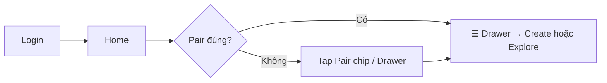
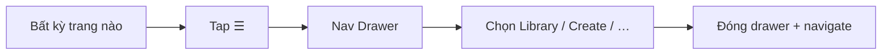
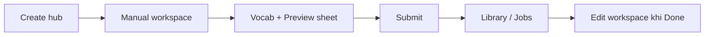
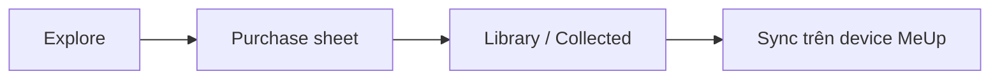

# Kế hoạch bố trí lại màn hình MeUp Web (nâng UX)

Tài liệu này đề xuất **bố cục lại thông tin (IA) và layout các màn hình** để giảm ma sát khi tạo / quản lý / mua sản phẩm từ vựng, dựa trên cấu trúc code hiện tại (React + Vite + Tailwind).

> Không phải redesign visual từ đầu. Mục tiêu: **đúng chỗ → đúng lúc → ít bước thừa → ít mật độ**.  
> **Ưu tiên mobile:** shell gọn + **drawer menu** để nhảy trang nhanh; desktop giữ nav ngang.  
> **Phạm vi màn hình:** inventory **đầy đủ mọi màn / overlay user** (xem **Phụ lục D**). **Chỉ loại trừ Admin** (`/admin*`).

---

## 0. Chiến lược mobile (ưu tiên)

### 0.1 Quyết định navigation

| Breakpoint | Pattern | Lý do |
|------------|---------|--------|
| `< md` (~768px) | **Top bar + Drawer menu** (trái hoặc phải) | 5 mục nav + pair + account không vừa top; drawer chứa đủ mà không chiếm thumb zone cố định như bottom tabs |
| `≥ md` | Nav ngang giữa header (như hiện tại) | Đủ chỗ; drawer không cần |

**Không dùng bottom tab bar** trong phase này — dễ đụng sticky footer Create/Edit và bàn phím. Có thể revisit sau nếu analytics cho thấy mở drawer quá nhiều lần/session.

### 0.2 Mobile header (gọn, 1 hàng)

```
┌────────────────────────────────────────┐
│ ☰   MeUp          [🇻🇳→🇬🇧]   [✦ 120] │
└────────────────────────────────────────┘
     │                 │            │
  mở Drawer      đổi pair     credits/account
```

| Control | Hành vi |
|---------|---------|
| **☰ Menu** | Mở **Nav Drawer**; `aria-expanded`; focus trap; Esc / tap scrim để đóng |
| **Pair chip** | Luôn visible; tap → **bottom sheet** chọn ngôn ngữ (không mở full page Home) |
| **Credits** | Tap → menu nhỏ (balance · Get credits · theme · logout) **hoặc** mục tương ứng trong drawer |

Brand text phụ (“MeUp Web”) **ẩn trên mobile** để giữ 1 hàng.

### 0.3 Nav Drawer — cấu trúc

```
┌─────────────────────────────┐
│ MeUp                     ✕  │
│ 🇻🇳 → 🇬🇧  Đổi cặp ngôn ngữ │  ← tap = đóng drawer + mở pair sheet
├─────────────────────────────┤
│ ● Home                      │
│ ○ Library          (badge)  │  ← badge = jobs đang chạy (nếu > 0)
│ ○ Create                    │
│ ○ Explore                   │
│ ○ Earn                      │
├─────────────────────────────┤
│ Credits             120     │
│ Get credits                 │  ← khi có API
│ Dark mode              [◐]  │
│ Log out                     │
└─────────────────────────────┘
     scrim 40–50% ngoài drawer
```

**Hành vi**

- Item active = `aria-current="page"` + highlight `accent-soft` (reuse `MainNav` / `isNavItemActive`).
- Tap link → **đóng drawer rồi navigate** (tránh drawer kẹt mở sau route change).
- Body scroll **lock** khi mở; restore khi đóng.
- Vuốt từ cạnh trái để mở (nice-to-have phase sau); phase 1: nút ☰ là đủ.
- Chiều rộng drawer ~ **min(86vw, 320px)**; không full-screen để vẫn thấy scrim (orientation).
- Safe area: `padding-top/bottom` theo `env(safe-area-inset-*)`.

**So với hiện tại**

| Hiện tại (`Header`) | Sau |
|---------------------|-----|
| Dropdown nhỏ `w-52` dưới nút hamburger | **Drawer full-height** + scrim, nhóm nav + account |
| Credits menu tách riêng | Gộp account/settings vào **cùng drawer** (giảm 2 popup chồng) |
| Pair chỉ trên Home | Pair trên header + đầu drawer |

### 0.4 Nguyên tắc layout mobile cho mọi trang

1. **Content max 1 cột**; padding `px-4`; tránh horizontal scroll.  
2. **Sticky footer** chỉ cho primary actions (Save / Submit / Buy) — cao ~56–64px + safe area.  
3. **Tab / segment** trên Library: scroll ngang hoặc segmented control full-width (không wrap 4 tab chật).  
4. **Modal sâu → drawer/sheet full-height** trên mobile (Config, Preview, Media, Pair picker).  
5. **Vocab table:** card-per-row hoặc horizontal scroll có sticky cột từ; không ép 6 cột trên 375px.  
6. **Touch target ≥ 44×44px**; khoảng cách giữa nút ≥ 8px.  
7. **Không chồng 2 overlay** (vd. drawer + credits dropdown cùng lúc).

### 0.5 Wireframe các màn trên mobile (~375)

**Home**

```
[☰ MeUp] [Pair] [Credits]
Welcome
1 dòng subtitle
[ Continue: job / product gần đây ]
[ + Create product     ]  ← primary
Snapshot: 3 số nhỏ (Library · Jobs · Credits)
```

**Library**

```
[☰] [Pair] [Credits]
Mine | Collected | Jobs     ← scroll/segment
[+ Create]
┌ card product ──────── ⋯ ┐
└ tap card / ⋯ → action sheet: Edit · Settings · Share ┘
```

**Create hub**

```
Chọn cách tạo
[ Manual — full width card ]
[ From topic ]
[ From text ]
[ From image ]
Jobs đang chạy → Library
```

**Create/Edit workspace**

```
[←] Title…          [Preview]
Vocab: list cards / rows
[ + Add word ]
──────── sticky ────────
[ Config ] [ Save ] [ Publish ]
Tap Preview → bottom sheet card play
Tap Config → full-height drawer (steps)
```

---

## 1. Hiện trạng (tóm tắt)

### 1.1 Bản đồ route chính

| Route | Màn hình | Vai trò |
|-------|----------|---------|
| `/` | Home | Chọn language pair + shortcut |
| `/products` | Products | Owned / Purchased / Shared / Create requests |
| `/products/new` | Create hub | Chọn 4 mode tạo |
| `/products/new/manual` · `ai/title` · `ai/paragraph` · `ai/image` | Create forms | Form tạo + Config modal + Vocab (manual) |
| `/products/:id/edit` | Edit | Metadata + Vocab table + Config + Publish |
| `/explore` | Explore | Catalog mua bằng credits |
| `/seller` | Seller | Sales / Payout history |
| Auth / gate | Shell riêng | Login, Register, Verify email, QR loading (chi tiết **Phụ lục D**; **Admin loại trừ**) |

### 1.2 Persona & việc cần làm

1. **Người học / chủ thiết bị** — chọn cặp ngôn ngữ, sync sản phẩm lên MeUp device  
2. **Người tạo nội dung** — tạo (manual/AI), cấu hình thẻ, media, publish  
3. **Người mua** — Explore → mua bằng credits  
4. **Seller** — theo dõi doanh số / payout  
5. **Admin** — **loại trừ khỏi plan này** (không inventory / không redesign)

### 1.3 Pain points từ cấu trúc hiện tại

| # | Vấn đề | Hệ quả UX |
|---|--------|-----------|
| P1 | **Language pair chỉ có trên Home** | User dễ “mất ngữ cảnh” khi vào Products/Explore (filter theo pair nhưng không đổi được tại chỗ) |
| P2 | **Config card nằm trong 1 modal sâu** (schema → levels → side → display) | Khó định hướng, dễ mệt trên mobile, preview/edit chen chúc |
| P3 | **Vocab UX lệch Create vs Edit** | Manual create = table trong dialog; Edit = table trên trang |
| P4 | **Nav trùng Home shortcuts** | Home ≈ bản thu nhỏ của nav; Seller thiếu trên Home |
| P4b | **Mobile nav = dropdown mỏng** | Hamburger mở panel nhỏ, dễ lệch/đóng sớm; không đủ chỗ pair + account + badge Jobs |
| P5 | **Account surface mỏng** | Credits chỉ hiện số; không có mua credits / profile / settings rõ ràng |
| P6 | **Products = 4 tab trong 1 trang dày** | Owned vs requests vs purchased cạnh nhau → khó progressive disclosure |
| P7 | **Create = nav item + hub + 4 form** | OK về discovery, nhưng thiếu “tiến độ / trạng thái job” gần chỗ tạo |
| P8 | **i18n wizard cũ còn sót** (`Name → Schema → Cards → Words → Done`) | IA thật ≠ copy cũ → dễ confuse khi chỉnh i18n / docs |

---

## 2. Nguyên tắc thiết kế lại

1. **Mobile-first + drawer nav** — `< md` đi qua drawer; `≥ md` nav ngang.  
2. **Language pair luôn trong tầm tay** — chip header + đầu drawer; đổi được mọi lúc.  
3. **Một việc / một vùng** — mỗi viewport chính có 1 mục tiêu rõ.  
4. **Tạo & chỉnh nội dung = full-page workspace**, không nhồi wizard sâu vào modal; trên mobile dùng **sheet/drawer**.  
5. **Create / Edit cùng mental model** — cùng layout: Metadata | Vocab | Card preview.  
6. **Giữ token & chrome hiện có** (`surface`, `accent`, Header sticky) — chỉ đổi bố trí, không đổi “skin” trừ khi cần.  
7. **Desktop:** split preview cho card config; **mobile:** preview/config = overlay có thể đóng.  
8. **Làm theo phase** — ship drawer + pair trước; deep editor sau.

---

## 3. IA đề xuất (sau khi bố trí lại)

```
App shell
├── Mobile header (< md)
│   ├── ☰ → Nav Drawer (trang + account + pair shortcut)
│   ├── Brand (ngắn)
│   ├── Language pair chip → pair bottom sheet
│   └── Credits chip → account menu (hoặc chỉ trong drawer)
│
├── Desktop header (≥ md)
│   ├── Brand
│   ├── Main nav ngang: Home · Library · Create · Explore · Earn
│   ├── Language pair chip
│   └── Account / credits menu
│
├── /                     Home (dashboard nhẹ)
├── /library              Library (ex-Products, rename UX)
│   ├── ?tab=owned|purchased|shared|jobs
│   └── /library/:id/edit Editor workspace
├── /create               Create hub
│   ├── /create/manual
│   ├── /create/topic
│   ├── /create/text
│   └── /create/image
├── /explore              Marketplace
└── /earn                 Seller (sales + payout)
```

### Ghi chú route

- Có thể **giữ path kỹ thuật** `/products/*` và chỉ đổi label/nav (ít breaking).  
- Hoặc migrate dần `/library`, `/create` với redirect từ path cũ (đã có pattern legacy `/programs` → `/products`).  
- **Khuyến nghị phase 1:** giữ URL, đổi layout & label trước.

### Đổi tên nav (gợi ý copy)

| Hiện tại | Đề xuất | Lý do |
|----------|---------|--------|
| My products | **Library** / Thư viện | Bao owned + purchased + shared |
| Create | **Create** (giữ) | CTA rõ |
| Seller | **Earn** / Kiếm credits | Dễ hiểu hơn “Seller” với learner |

---

## 4. Bố trí từng màn hình

### 4.1 App shell — Header + Nav Drawer (ưu tiên cao nhất)

Chi tiết wireframe: **§0**. Tóm tắt triển khai:

**Desktop (≥ md)**

```
[Logo]  Home | Library | Create | Explore | Earn    [Pair ▾]  [✦ Credits ▾]
```

**Mobile (< md)**

```
[☰]  MeUp    [Pair ▾]  [✦]
      └─ Nav Drawer (xem §0.3)
```

| Vùng | Hành vi |
|------|---------|
| **Nav Drawer** | Primary navigation mobile; gồm 5 trang + pair shortcut + account |
| **Pair chip** | Mọi breakpoint; mobile → bottom sheet `LanguagePicker` |
| **Credits** | Desktop: menu; mobile: có thể chỉ trong drawer để giảm clutter header |

**Component đề xuất**

| Mới / chỉnh | Vai trò |
|-------------|---------|
| `NavDrawer` | Overlay + panel; nhận `open` / `onClose`; render nav items + account block |
| `Header` | Tách mobile/desktop chrome; thay dropdown `w-52` bằng drawer |
| `MainNav` | Reuse list items trong drawer **và** desktop bar (prop `orientation`) |
| `LanguagePairSheet` | Bottom sheet mobile cho pair (reuse picker) |

**Acceptance**

- Từ mọi trang mobile: ≤ 2 tap tới Home / Library / Create / Explore / Earn.  
- Đổi pair không cần về Home.  
- Drawer đóng đúng khi navigate / Esc / scrim; không scroll body phía sau.  
- Focus: mở drawer → focus vào nút đóng hoặc item đầu; đóng → trả focus về ☰.

---

### 4.2 Home — dashboard nhẹ (mobile 1 cột)

**Mục tiêu:** “Cặp X đang chọn — việc tiếp theo / tạo nhanh.”

**Mobile**

```
Greeting + 1 câu
[Continue card — job hoặc product gần đây]
[+ Create product]          ← full-width primary
Hàng số: Library · Jobs · Credits
```

**Desktop:** thêm cột Quick create modes nếu cần.

**Bỏ / giảm**

- Form chọn language pair chiếm nửa trang (→ header / drawer / pair sheet).  
- Grid 3 `ActionCard` trùng nav (nav đã có trong drawer).

**Acceptance**

- First paint ≤ 1 scroll trên 375px.  
- Không còn là trang “chỉ để chọn ngôn ngữ”.

---

### 4.3 Library (Products) — giảm mật độ, thân thiện ngón tay

**Trước:** 4 tab + nhiều CTA trên mỗi row.

**Sau — 2 tầng**

1. **Segments** (3): Mine · Collected · Jobs (badge trên segment + trên item Library trong drawer)  
2. **Toolbar:** Search (optional phase 2) · `+ Create`  
3. **Mobile item = card**; hành động trong **action sheet** (Edit / Settings / Share) — không 3 nút trên card  

**Jobs**

- `working` / `failed` lên đầu.  
- `success` → “Open result” → Edit.  
- Create xong → deep-link `?tab=jobs`.

**Acceptance**

- Phân biệt Mine / Jobs / Collected trong 1 glance.  
- Mobile: ≤ 1 primary action visible mỗi card.

---

### 4.4 Create hub — stack dọc trên mobile

```
Title + 1 câu subtitle
[ Manual ]          ← full width, primary
[ From topic ]      ← hiện ~credits
[ From text ]
[ From image ]
Link: Jobs đang chạy → Library
```

Desktop có thể 2×2 grid.

**Acceptance**

- Biết input + credits trước khi vào form.  
- Có đường tới Jobs.

---

### 4.5 Create / Edit workspace — mobile sheet-first

**Desktop:** 2 cột (Vocab | Preview) như plan cũ.

**Mobile (bắt buộc khác desktop)**

```
┌ App header (☰ Pair Credits) — có thể rút gọn khi scroll ┐
│ [← Back]  Title…                        [Preview]       │
│ Vocab list (card rows) + Add word / CSV                   │
│ Schema: accordion gọn (optional)                          │
├ sticky footer (safe-area) ───────────────────────────────┤
│ [Config]              [Save draft]     [Publish/Submit]   │
└──────────────────────────────────────────────────────────┘
```

| Action | UI mobile |
|--------|-----------|
| Preview card | **Bottom sheet** ~70–90vh, play sides |
| Config (schema/levels/side/display) | **Full-height drawer** bước ngang hoặc accordion; không modal `max-h-[92vh]` chen header |
| Media picker | Full-height sheet (giữ 4 nguồn) |
| Unsaved | Confirm khi Back / mở Nav Drawer rời trang |

**Mapping**

| Hiện tại | Sau (mobile) |
|----------|----------------|
| `CustomConfigDialog` | Config drawer full-height |
| `VocabEntryDialog` | Vocab trên trang (như Edit) |
| `AiCreateFooter` | Sticky footer + safe area |
| Dropdown nav | Nav Drawer (§0) — **ẩn ☰ hoặc confirm** nếu có dirty state |

**Acceptance**

- Create manual ≈ Edit về cấu trúc.  
- Happy path schema không bắt buộc overlay xếp chồng.  
- Preview/Config đóng bằng nút ✕ / vuốt xuống (sheet) / Back hệ thống.

---

### 4.6 Explore — marketplace mobile

```
Pair chip (header) = filter
[Search] (optional)
Cards 1 cột (hoặc 2 nếu ≥400px)
Empty: đổi pair (sheet) hoặc Create
Buy → confirm sheet (đủ/thiếu credits)
```

**Acceptance**

- Mua ≤ 2 tap sau khi chọn card.  
- Sau mua → link Library / Collected.

---

### 4.7 Earn (Seller)

```
Summary: earned · pending (stack dọc)
Tabs: Sales | Payouts
Tables → card rows trên mobile
```

**Acceptance**

- Câu trả lời đầu: “Đã kiếm bao nhiêu?”

---

### 4.8 Auth & gate (đầy đủ — không dùng app Nav Drawer)

Shell riêng (không Header app). Chi tiết công năng: **Phụ lục D §D1–D2**.

| Màn / trạng thái | Route / trigger | Ghi chú layout mobile |
|------------------|-----------------|------------------------|
| Session loading | Gate khi redeem QR / check session | Full viewport spinner |
| Login | `/login` | Form 1 cột; Google + email |
| Register | `/register` | Form 1 cột; Google + email |
| Verify email | `/verify-email?token=` | Success / fail + về Home |
| Verify banner | Trong app khi email chưa verify | Strip dưới header; Resend |
| QR redeem fail | Hiện → Login (NotFoundPage chưa gắn) | Cân nhắc trang “link hết hạn” |

### 4.9 Admin — **ngoài phạm vi plan này**

`/admin`, `/admin/panel`, `/admin/config` không bố trí lại trong tài liệu này.

---

## 5. Luồng người dùng mục tiêu (sau redesign)

### 5.1 Lần đầu sau login (mobile)



### 5.2 Nhảy trang bằng Drawer



### 5.3 Tạo manual nhanh



### 5.4 Mua & học



---

## 6. Roadmap triển khai

### Phase 0 — Chuẩn bị (0.5–1 ngày)

- [ ] Chốt giữ URL `/products` hay rename `/library`
- [ ] Dọn i18n wizard orphan (`createProgram.wizard.*`) hoặc đánh dấu deprecated
- [ ] Baseline screenshot **375 · 768 · 1280** (đặc biệt Header/hamburger hiện tại)
- [ ] Chốt: account (theme/logout) **chỉ trong drawer** hay vẫn có credits chip riêng trên mobile

### Phase 1 — Mobile shell: Drawer + Pair (impact cao / effort thấp–TB) ← làm trước

- [ ] Component `NavDrawer` (scrim, focus trap, scroll lock, safe area)
- [ ] `Header` mobile: `☰ | Brand | Pair | Credits` — bỏ dropdown nav `w-52`
- [ ] Reuse `MAIN_NAV_ITEMS` / `MainNav` trong drawer; active state đúng
- [ ] Pair chip → bottom sheet (mobile) / popover (desktop)
- [ ] Badge Jobs trên item Library trong drawer (phase 1.1 nếu API sẵn)
- [ ] Thu gọn Home: bỏ pair form lớn; Continue + CTA Create
- [ ] (Optional) Label nav Library / Earn
- [ ] i18n: `nav.openMenu`, `nav.closeMenu`, `nav.drawerLabel`, …

**Done when:** trên 375px, mọi trang chính mở được từ drawer trong 2 tap; đổi pair không cần về Home.

### Phase 2 — Library & list mobile

- [ ] Segment Mine / Collected / Jobs + badge
- [ ] Card + action sheet (Edit / Settings / Share)
- [ ] Empty states + Create success → `?tab=jobs`
- [ ] Create hub stack 1 cột + credits hint

**Done when:** Library dùng được một tay; Jobs dễ tìm.

### Phase 3 — Workspace Create/Edit (mobile sheet / drawer)

- [ ] Spec breakpoint: desktop split vs mobile sheets
- [ ] Config → full-height drawer; Preview → bottom sheet
- [ ] Manual create = Edit shell; sticky footer + safe area
- [ ] Dirty-state guard khi mở Nav Drawer / Back
- [ ] AI forms ngắn → Jobs → Edit

**Done when:** happy path không phụ thuộc modal config cũ; Vocab không dialog-only.

### Phase 4 — Explore & Earn polish mobile

- [ ] Explore 1-cột cards + buy confirm sheet
- [ ] Earn summary + card rows
- [ ] Polish animation drawer (≤ 250ms, tôn trọng reduced-motion)

### Phase 5 — Đo & chỉnh

- [ ] Số lần mở drawer / session
- [ ] Time-to-first-vocab-row (manual)
- [ ] % đổi pair từ non-Home
- [ ] Task success mobile: Edit 1 display element; Navigate Home→Create→Library
- [ ] (Chỉ khi data xấu) xét lại bottom tabs

---

## 7. Ưu tiên theo effort / impact

| Hạng | Việc | Impact | Effort |
|------|------|--------|--------|
| 1 | **Nav Drawer + Header mobile** | Rất cao | TB |
| 2 | Pair chip + pair sheet | Cao | Thấp–TB |
| 3 | Home dashboard nhẹ | Cao | Thấp |
| 4 | Library cards + action sheet | Trung–Cao | TB |
| 5 | Create/Edit mobile sheets | Rất cao | Cao |
| 6 | Explore/Earn polish | Trung | Thấp |
| 7 | Rename routes | Thấp | TB |

---

## 8. Rủi ro & chống phạm vi

| Rủi ro | Cách giảm |
|--------|-----------|
| Drawer + keyboard / sticky footer đụng nhau | z-index: header < sheet < drawer < toast; không mở 2 overlay cùng lúc |
| Dirty edit mất khi tap nav trong drawer | Confirm trước khi navigate (§4.5) |
| Đụng `CustomConfigDialog` phá publish | Phase 3 flag; modal = fallback Advanced |
| Đổi URL gãy deep link | Phase 1 chỉ UI; redirect sau |
| Scope creep visual | Giữ tokens `index.css` |
| Vuốt mở drawer conflict scroll ngang | Phase 1 **không** edge-swipe; chỉ nút ☰ |

**Không làm trong plan này (trừ khi chốt riêng)**

- Bottom tab bar (đã loại ở §0.1)
- Redesign brand / marketing landing
- Admin UX
- Thay design system bằng skill generic

---

## 9. Checklist UX trước khi ship mỗi phase

**Chung**

- [ ] Contrast text ≥ 4.5:1 (light & dark)
- [ ] Touch target ≥ 44×44px
- [ ] Focus ring keyboard
- [ ] `prefers-reduced-motion`
- [ ] Breakpoints: **375 · 768 · 1024 · 1440**
- [ ] Pair context visible khi list phụ thuộc pair
- [ ] Empty / error / loading có bước tiếp
- [ ] Không `window.alert` cho lỗi chính

**Riêng Drawer / mobile shell**

- [ ] Scrim tap + Esc đóng drawer
- [ ] `aria-modal` / dialog (hoặc disclosure đúng) + label
- [ ] Focus trap khi mở; restore focus khi đóng
- [ ] Body scroll lock
- [ ] Safe-area insets (notch / home indicator)
- [ ] Không mở đồng thời drawer + credits menu + pair sheet
- [ ] Active route highlight đúng sau navigate

---

## 10. Kết luận ngắn

Inventory màn hình user (trừ Admin) nằm ở **Phụ lục D**. Trên **mobile**, điểm nghẽn lớn nhất là **không có chỗ điều hướng đủ rộng** (dropdown hamburger mỏng) cộng với pair/config bị chôn sâu.

Thứ tự làm tối ưu:

1. **Nav Drawer + Header gọn + Pair chip** — nhảy trang tiện ngay
2. **Library / Home gọn cho ngón tay**
3. **Create/Edit dùng sheet & drawer** thay modal dày

Desktop giữ nav ngang; không dùng bottom tabs trong giai đoạn này.

---

## Phụ lục A — Mapping file chính (để triển khai)

| Vùng | File gợi ý |
|------|------------|
| **Nav Drawer / shell** | `Header.tsx` (refactor), **`NavDrawer.tsx` (mới)**, `MainNav.tsx`, `config/nav.ts` |
| Pair context | `LanguagePairProvider`, `LanguagePicker`, **`LanguagePairSheet` (mới)**, HomePage |
| Library | `ProductsPage.tsx`, modals Settings/Share |
| Create hub | `CreateProgramHubPage.tsx` |
| Create forms | `CreateProgram*Page.tsx`, `AiCreatePageShell`, `AiCreateFooter` |
| Config | `CustomConfigDialog` + card/side/display editors → mobile drawer |
| Vocab | `VocabEntryTable`, `VocabEntryDialog`, `MediaPickerDialog` |
| Edit | `EditProgramPage.tsx` |
| Explore / Seller | `ExplorePage.tsx`, `SellerPage.tsx` |
| Auth / gate | `AuthPages.tsx`, `VerifyEmailPage.tsx`, `AuthGatePages.tsx`, `DeviceSessionProvider`, `GoogleSignInButton`, `VerifyEmailBanner` |
| Copy | `src/locales/en.json`, `vi.json` |
| Inventory đầy đủ | **Phụ lục D** |

## Phụ lục C — Spec nhanh `NavDrawer` (cho dev)

| Prop / hành vi | Chi tiết |
|----------------|----------|
| `open` / `onClose` | Controlled từ `Header` |
| Placement | Trái (LTR); width `min(86vw, 320px)` |
| z-index | Trên header content, dưới toast |
| Nav source | `MAIN_NAV_ITEMS` + `t(labelKey)` |
| On navigate | `onClose()` rồi để router đổi page |
| Account block | Credits, Get credits, Dark mode toggle, Logout |
| A11y | `role="dialog"`, `aria-modal="true"`, labelledby title |

## Phụ lục B — Câu hỏi cần product chốt

1. Mobile: credits chip trên header **hay** chỉ trong drawer? (khuyến nghị: giữ chip số; theme/logout trong drawer)
2. Schema mặc định có đủ 80% user không mở Config drawer?
3. Publish từ Create manual: 1 bước hay luôn qua Jobs/draft?
4. Purchased + Shared: gộp Collected hay tách?
5. Dirty workspace: block mở drawer hay cho mở nhưng confirm khi chọn link?

---

## Phụ lục D — Inventory đầy đủ màn hình & công năng (trừ Admin)

> Nguồn: routes `App.tsx`, gate `DeviceSessionProvider`, pages/components hiện có.  
> **Loại trừ:** `/admin`, `/admin/panel`, `/admin/config` và mọi UI admin.  
> Ký hiệu: **Page** = full page · **Overlay** = modal/dialog/menu · **Banner** · **Gate** · **Chrome**

### D0. Bản đồ nhanh (non-admin)

```
Gate: loading | unauthorized → /login|/register
      /verify-email (public)
      authorized → App shell (Header + optional VerifyEmailBanner)

/                         Home
/products                 Library (+ Settings / Share overlays)
/explore                  Explore
/seller                   Earn
/products/new             Create hub
/products/new/manual      Manual (+ Vocab dialog, Config)
/products/new/ai/title    AI topic (+ Config)
/products/new/ai/paragraph AI text (+ Config)
/products/new/ai/image    AI image (+ Config)
/products/:id/edit        Edit (+ Config, Vocab table → Media)
/programs/*               Redirect → /products/*
```

---

### D1. Gate & Auth

| Màn / trạng thái | Cách mở | File | Loại | Công năng chính |
|------------------|---------|------|------|-----------------|
| Session loading | `status === 'loading'` (QR redeem / session) | `AuthGatePages.tsx` → `AuthLoadingPage` | Gate | Spinner; “Verifying device link…” |
| Login | `/login` (+ `*` → login khi chưa auth) | `AuthPages.tsx` → `LoginPage` | Page | Google Sign-In; email/password; lỗi; link Register |
| Register | `/register` | `AuthPages.tsx` → `RegisterPage` | Page | Google Sign-Up; email/password/confirm; lỗi; link Login |
| Google button | Trong Login/Register | `GoogleSignInButton.tsx` | Widget | GSI; divider “or”; lỗi load/token |
| Verify email | `/verify-email?token=` | `VerifyEmailPage.tsx` | Page | Verifying / success / fail; về Home |
| QR redeem | Path `/<order>-<mac>` hoặc `?authCode=` | `DeviceSessionProvider` | Gate flow | Success → `/`; fail → Login |
| NotFound (QR xấu) | **i18n có, chưa mount** | `AuthGatePages.tsx` → `NotFoundPage` | Dead | “Link invalid/expired” — **chưa gắn UI** |

**Mobile UX (Auth):** form 1 cột, không Nav Drawer; safe area; Google button full width.

---

### D2. Chrome app (sau khi đã login)

| UI | Cách mở | File | Loại | Công năng chính |
|----|---------|------|------|-----------------|
| Header | Luôn trong `App` | `Header.tsx` | Chrome | Brand → Home; credits; account menu |
| Main nav desktop | Header | `MainNav.tsx` + `config/nav.ts` | Chrome | Home · My products · Create · Explore · Seller |
| Mobile nav (hiện tại) | ☰ | Dropdown trong `Header` | Overlay | Cùng 5 link — **plan: thay bằng Nav Drawer** |
| Credits / account menu | Nút credits | `Header.tsx` | Overlay | Số credits; Dark mode; Logout |
| Theme | Trong account menu | `ThemeProvider` | Control | Light / dark |
| Logout | Account menu | `App.handleLogout` | Action | Clear session → `/login` |
| Verify email banner | Email chưa verify | `VerifyEmailBanner.tsx` | Banner | Message; Resend; Sending / Sent / Error |

**Sau redesign (§0):** ☰ → `NavDrawer` (nav + pair shortcut + account); Pair chip trên header.

---

### D3. Trang chính

#### D3.1 Home — `/` · `HomePage.tsx` · Page

| Công năng | Chi tiết |
|-----------|----------|
| Welcome | Title + subtitle |
| Language pair | Native + study pickers; cảnh báo cùng ngôn ngữ; hiện `langPair` |
| Shortcuts | Cards → Products, Create, Explore |

**Plan:** pair lên header/drawer; Home → dashboard Continue + CTA Create.

#### D3.2 My products (Library) — `/products` · `ProductsPage.tsx` · Page

| Vùng | Công năng |
|------|-----------|
| Toolbar | CTA Create → `/products/new`; filter hint theo pair |
| States | Loading; error + Retry; empty theo tab |
| Tab **Owned** | List; badge Public/Private; Edit content; Share; Settings; View on Explore (nếu public) |
| Tab **Purchased** | List; credits đã trả; ngày mua; View on Explore |
| Tab **Shared** | Badge shared; package size; file count; hint sync device |
| Tab **Create requests** | List (type, status, credits, id); Refresh (cooldown 5s + toast); progress % / job counts; pagination |

**Overlays từ trang này**

| Overlay | Mở từ | File | Công năng |
|---------|-------|------|-----------|
| Product settings | Owned → Settings | `ProductSettingsModal.tsx` | Name; description; Public/Private; credit price; Save / Cancel |
| Product share | Owned → Share | `ProductShareModal.tsx` | List shares; Revoke; Add email và/hoặc device order; Share / Close |
| Requests toast | Refresh sớm / lỗi | Inline `ProductsPage` | Auto-dismiss ~4s |

**Plan:** segment Mine / Collected / Jobs; action sheet thay 3 nút trên card.

#### D3.3 Explore — `/explore` · `ExplorePage.tsx` · Page

| Công năng | Chi tiết |
|-----------|----------|
| Catalog | Theo language pair |
| States | Loading; empty; error + Retry |
| Card | Name; description; vocab count; giá credits; badge “can use” |
| Purchase | Nút mua + busy; lỗi insufficient credits / already purchased / … |
| Pagination | Prev / Next |

#### D3.4 Seller (Earn) — `/seller` · `SellerPage.tsx` · Page

| Tab | Công năng |
|-----|-----------|
| Sales | Product; credits; sold at; buyer id; pagination |
| Payout history | Amount ±; channel; date; detail |
| States | Loading; empty; error + Retry |

**Plan:** summary strip earned / pending phía trên tabs.

---

### D4. Create

#### D4.1 Hub — `/products/new` · `CreateProgramHubPage.tsx` · Page

- 4 mode cards: Manual · AI topic · AI paragraph · AI image  
- Back → Products  
- `/products/new/ai/:mode` không hợp lệ → redirect hub  

#### D4.2 Chrome chung AI / Manual create

| UI | File | Loại | Công năng |
|----|------|------|-----------|
| `AiCreatePageShell` | `AiCreatePageShell.tsx` | Layout | Back hub; pair hint; success banner + link Create requests; error banner |
| `AiCreateFooter` | `AiCreateFooter.tsx` | Actions | Configuration; Back; Submit / Submitting |
| Refund note | Trong footer file | Inline | Hoàn credits thừa sau packaging |
| Config | `CustomConfigDialog` | Overlay | Xem **D6** |

#### D4.3 Manual — `/products/new/manual` · `CreateProgramManualPage.tsx` · Page

| Bước | Công năng |
|------|-----------|
| Form | Title (bắt buộc); description optional |
| Footer | Config · Back · Continue → `VocabEntryDialog` |
| Cleanup | `cancel-manual` nếu bỏ giữa chừng sau khi mở vocab |
| Success | Shell banner → xem Create requests |

#### D4.4 AI topic — `/products/new/ai/title` · `CreateProgramFromTitlePage.tsx` · Page

- Topic/title; description; word count (+ min/max); **credits estimate**; refund note; Config; Submit; chặn nếu thiếu credits  

#### D4.5 AI paragraph — `/products/new/ai/paragraph` · `CreateProgramFromParagraphPage.tsx` · Page

- Paragraph (≥20 chars); title/description optional; word count; credits estimate; refund note; Config; Submit  

#### D4.6 AI image — `/products/new/ai/image` · `CreateProgramFromImagePage.tsx` · Page

- Upload jpeg/png/webp/gif; compress; preview (name, size, dimensions); title/description optional; word count; credits estimate; refund note; Config; Submit  

---

### D5. Edit — `/products/:productId/edit` · `EditProgramPage.tsx` · Page

| Trạng thái | Công năng |
|------------|-----------|
| Loading | “Loading editor…” |
| Not found / load error | Message + back Products |
| Editor | Title; description; `VocabEntryTable`; Config; **Save draft** (saving/saved/failed); **Publish** |
| Publishing | Full-page progress hint |
| Publish success | Version id; Continue edit / Back products |
| Publish failed | Message + quay lại editor |

**Nguồn load (code):** draft → else import published package → else preset mặc định.  
**Publish API:** `export-version`. Media staging qua `tempId` + cleanup khi unmount.

---

### D6. Config card — `CustomConfigDialog` · Overlay

Mở từ: Manual, 3 AI create, Edit.

| Step | UI con | Công năng |
|------|--------|-----------|
| `schema` | `ItemSchemaEditor`, `SchemaFieldList` | Bật/tắt image; thêm Text / Text+Audio; label; description; lang role; reorder; remove; Generate missing descriptions; Close; Continue |
| `levels` | `CardSetupStep` | Levels; boundaries; sides add/remove/reorder; edit side; live preview; Back; Continue (= Apply & đóng) |
| `sideEdit` | `SideEditorStep` | Background; display elements; play/pause sequence; reorder/delete; wide = editor inline |
| `displayEdit` | `DisplayElementEditorStep` (narrow) | Pos/size/radius; z-order; text style (color, opacity, align, max lines); delete; back |
| Nested | `ColorPickerField` | Palette / hex; Done / Cancel |

**Plan mobile:** full-height Config drawer / sheets thay modal `max-h-[92vh]`.

---

### D7. Vocab & Media

| UI | Cách mở | File | Loại | Công năng |
|----|---------|------|------|-----------|
| Vocab dialog | Manual → Continue | `VocabEntryDialog.tsx` | Overlay | Bọc table; checkbox generate missing media (~credits); Cancel (`cancel-manual`) / Create product |
| Vocab table | Dialog (manual) hoặc Edit page | `VocabEntryTable.tsx` | Embedded | Sửa ô text; thêm/xóa dòng; audio attach + play; image attach |
| CSV bar | Trong table | `VocabCsvImportBar.tsx` | Toolbar | Download template; import CSV; confirm replace/append |
| Media picker | Icon media trên table | `MediaPickerDialog.tsx` | Overlay | Tabs: **Upload · Clipboard · URL · Generate AI**; preview; Apply / Cancel |

---

### D8. Legacy / unused (không phải màn product, ghi nhận)

| Item | Trạng thái |
|------|------------|
| `PlaceholderPage.tsx` | Không route |
| `NotFoundPage` (QR) | Chưa mount |
| `/programs/*` | Redirect → `/products/*` |
| i18n `createProgram.wizard.*` | Orphan (wizard cũ đã gỡ) |

---

### D9. Công năng chưa có / bỏ qua (user-facing, non-admin)

| Công năng | Trạng thái | Ghi chú |
|-----------|------------|---------|
| Retry create job | **Chưa có UI** | API `…/jobs/{jobId}/retry`; list chưa trả `jobId` ổn định |
| Get / top-up credits (user) | **Chưa có UI** | Header chỉ hiện số; plan để chỗ trong drawer |
| Restore version | Bỏ qua | Không có API list version |
| Package-link download (web) | Bỏ qua | Sync chủ yếu qua device |
| NotFound QR page | i18n sẵn, chưa gắn | Fail hiện Login |

---

### D10. Checklist coverage (đối chiếu plan ↔ sản phẩm)

| Nhóm | Có trong inventory | Có hướng layout trong plan |
|------|--------------------|----------------------------|
| Auth Login/Register/Verify/Google | ✅ D1 | ✅ §4.8 |
| QR loading / redeem | ✅ D1 | ✅ §4.8 |
| Header / nav / theme / logout | ✅ D2 | ✅ §0 + §4.1 (Drawer) |
| Verify banner | ✅ D2 | Giữ vị trí dưới header |
| Home + language pair | ✅ D3.1 | ✅ §4.2 |
| Products 4 tabs + Settings/Share | ✅ D3.2 | ✅ §4.3 |
| Explore purchase | ✅ D3.3 | ✅ §4.6 |
| Seller sales/payout | ✅ D3.4 | ✅ §4.7 |
| Create hub + 4 modes | ✅ D4 | ✅ §4.4–4.5 |
| Edit draft/publish/import | ✅ D5 | ✅ §4.5 |
| Config 4 steps + color picker | ✅ D6 | ✅ §4.5 sheet/drawer |
| Vocab + CSV + Media 4 sources | ✅ D7 | ✅ §4.5 |
| Admin | — | **Loại trừ** |
| Retry job / Get credits | ✅ D9 (thiếu UI) | Get credits: chỗ drawer; Retry: sau khi API sẵn |

**Kết luận phụ lục:** Plan đã liệt kê **đầy đủ màn hình & công năng user** (trừ Admin). Phần còn thiếu UI thật (retry job, mua credits, NotFound QR) được ghi ở **D9**, không bỏ sót khỏi checklist.
